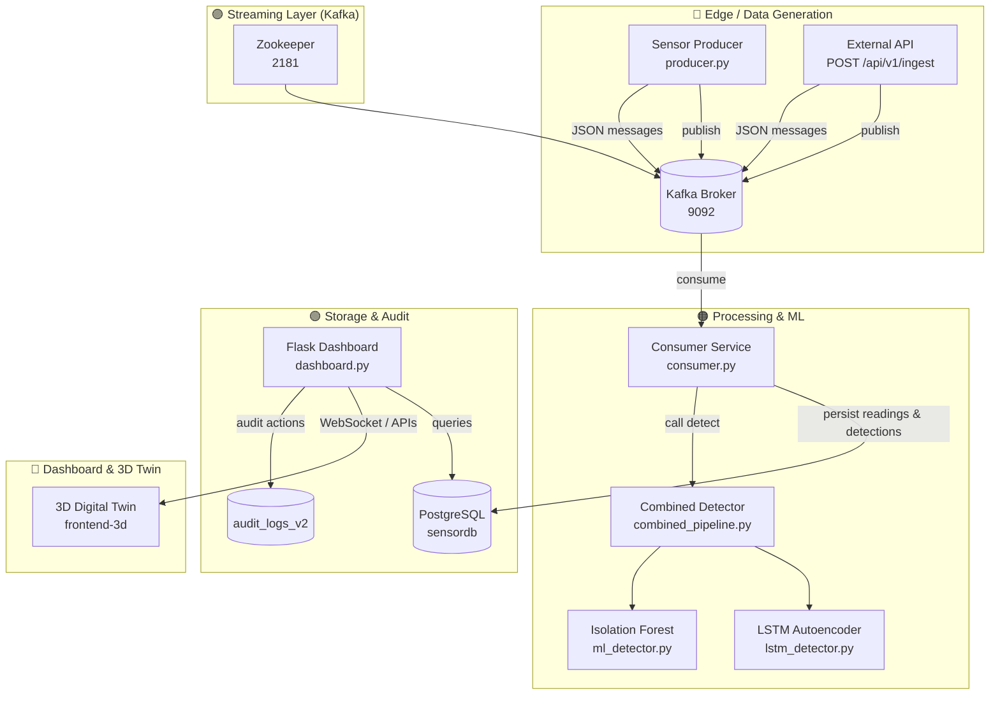

# Industrial Sensor Anomaly Detection Pipeline (Rig Alpha)

A comprehensive real-time industrial IoT monitoring system with hybrid ML anomaly detection, predictive maintenance, AI-powered analysis, immersive 3D Digital Twin visualization, and enterprise-grade audit logging.

---

## Executive Summary

Rig Alpha is an end-to-end platform designed to ingest real-time telemetry from industrial sensors, detect anomalies using a hybrid ML approach (Isolation Forest + LSTM Autoencoder), predict Remaining Useful Life (RUL), and surface findings via both a classic dashboard and an immersive 3D Digital Twin. The system is built for scale, observability, and explainability so engineering leads and executives can confidently operate and evaluate industrial equipment.

Key benefits:
- Real-time anomaly detection (streaming) and historical analysis (analytics)
- Hybrid detection reduces false positives and improves actionable alerts
- Rapid testing through an anomaly injection system and simulated producers
- Clear audit trails and compliance-ready logging
- Immersive executive-ready 3D visualization for fleet status and presentations

---

## Table of Contents

- Project Overview
- Quick Architecture Diagram (clickable sections)
- Component Details (color-coded)
- Getting Started
- ML & Analytics
- Storage & Data Model
- Dashboard & 3D Twin
- AI Integration
- Security & Audit Logging
- Deployment & Scaling
- Troubleshooting & FAQ

---

## Project Overview

Rig Alpha is designed to monitor 50+ sensor parameters grouped by categories (Environmental, Mechanical, Thermal, Electrical, Fluid, Custom). It supports multi-machine monitoring, anomaly injection for testing, and cloud-ready persistence.

Primary flows:
1. Sensors (simulated or real) -> Kafka topic(s)
2. Consumer(s) subscribe, run detection pipeline, and persist results
3. Dashboard & 3D Twin visualize realtime telemetry and anomalies
4. ML models trained from historical data to improve detection and RUL

---

## Quick Architecture Diagram



Click the architecture boxes in this README (or search the file) to jump to the corresponding component sections below.

---

## Component Details (color-coded)

- Blue (🔵) = Data Generation & Ingress
- Purple (🟣) = Streaming (Kafka) & Coordination
- Orange (🟠) = Processing, Detection & ML
- Green (🟢) = Storage & Audit
- Yellow (🔶) = Presentation: Dashboard & 3D Twin

### 🔵 Data Generation & Ingress

Files: `producer.py`, `producer_ketchup.py`, `/api/v1/ingest` implementation

Responsibilities:
- Generate or receive sensor data
- Apply anomaly injection rules (spikes, drift, stuck sensors)
- Publish JSON messages to Kafka topic(s)

Key behaviors in `producer.py`:
- Runs on a timer (config.INTERVAL_SECONDS)
- Calculates total messages from DURATION_HOURS and INTERVAL_SECONDS
- Supports custom sensors, dynamic thresholds, and control via Dashboard API
- Retries and graceful shutdown with signal handlers

Why it matters: a resilient producer lets us simulate real production behavior and verify downstream detection under controlled fault injection.

### 🟣 Streaming Layer

Files: `docker-compose.yml` (Kafka + Zookeeper), config for Kafka in `config.py`

Responsibilities:
- Durable, ordered message transport
- Decouples producers and consumers for independent scaling

Important docker-compose settings:
- Kafka advertised listeners configured for internal/external access
- Healthchecks for zookeeper and kafka
- PostgreSQL container configured with init SQL (setup_db.sql)

Operational notes:
- Kafka topics should be pre-provisioned in production with appropriate partitions and replication
- Monitor broker health and retention settings to ensure timely storage of telemetry

### 🟠 Processing & ML

Files: `consumer.py`, `combined_pipeline.py`, `ml_detector.py`, `lstm_detector.py`, `lstm_predictor.py`, `train_combined_detector.py`

Responsibilities:
- Consume Kafka messages, validate and persist raw readings
- Run anomaly detection (Isolation Forest + LSTM Autoencoder) and record detections
- Produce real-time telemetry for the 3D Twin and dashboard
- Offer prediction (RUL) endpoints and periodic report generation

Combined pipeline behavior (`combined_pipeline.py`):
- Supports detection strategies: `isolation_forest`, `lstm`, `hybrid_or`, `hybrid_and`, `hybrid_smart`
- Runs IF for point anomalies and LSTM for temporal/contextual anomalies
- When both models run, combines results according to configured strategy
- Records detection to DB with a standard schema (method, score, sensors)

ML training and requirements:
- Isolation Forest: requires baseline dataset (recommended 500+ readings)
- LSTM Autoencoder: requires time-series sequences; training may need GPU for speed
- Training script: `train_combined_detector.py`

Why hybrid: combining statistical and sequence models helps catch both sudden spikes and gradual degradation, minimizing false alerts.

### 🟢 Storage & Audit

Files: `setup_db.sql`, `neon_complete_setup.sql`, `DATABASE_CONFIG.md`, `DATABASE_CONFIG.md`

Responsibilities:
- Store raw telemetry (`sensor_readings`) with timestamps and metadata
- Store anomaly detections (`anomaly_detections`) with detection method, score, and sensors
- Maintain `audit_logs_v2` with action history and before/after state

Design notes:
- Use JSONB for flexible sensor payload storage and quick schema changes
- Use connection pooling (psycopg2 ThreadedConnectionPool) for performance
- Retention policies and hash chains are included for audit integrity

### 🔶 Presentation & Visualization

Files: `dashboard.py`, `templates/`, `frontend-3d/`, `static/`

Responsibilities:
- Serve a classic Flask dashboard with controls, user management, reports and charts
- Expose REST APIs for ingestion, model status, and RUL predictions
- Host WebSocket (Socket.IO) endpoints for the 3D Twin telemetry (10 Hz by default)
- Provide admin functionality (custom sensors, AI parsing, audit viewing)

3D Twin specifics:
- React + React Three Fiber frontend under `frontend-3d/`
- Uses transient state pattern (Zustand) to avoid excessive React re-renders
- Maps sensor values to visual effects (RPM → rotation, Temp → emissive glow, Vibration → shake, Anomaly → particles)

UX notes:
- Dashboard provides START/STOP, Sampling Speed (MPS), Anomaly Injection
- Dashboard emits control events to producer/consumer services

---

## Getting Started (Development)

Prerequisites:
- Docker Compose
- Python 3.10+ (project uses modern Python features)
- Node.js + npm (for frontend)

Quick start (local):

1) Start infrastructure

```bash
docker-compose up -d
```

2) Create virtualenv and install

```bash
python -m venv .venv
source .venv/bin/activate  # Linux/Mac
.\\.venv\\Scripts\\activate   # Windows PowerShell
pip install -r requirements.txt
```

3) Initialize DB (Docker compose mounts setup_db.sql automatically for Postgres init). If using existing DB, run migrations with `run_migration.py`.

4) Train models (first time)

```bash
python train_combined_detector.py
```

5) Start services

Terminal 1: `python dashboard.py`

Terminal 2: `python consumer.py`

Terminal 3: `python producer.py`

Terminal 4 (3D): `cd frontend-3d && npm install && npm run dev`

Open:
- Dashboard: http://localhost:5000
- 3D Twin: http://localhost:3000

---

## ML & Analytics (details)

Detection output format (example):

```json
{
  "reading_id": 12345,
  "is_anomaly": true,
  "score": 0.82,
  "method": "hybrid",
  "sensors": ["temperature_1", "vibration_3"],
  "timestamp": "2026-01-13T12:34:56Z"
}
```

Recording and reporting:
- Detections are stored and can be queried for drill-down analysis
- `report_generator.py` can build PDF reports (PyPDF2 required)
- `analysis_engine.py` provides contextual correlation help for root-cause

RUL prediction:
- Uses historical trends and configurable models (linear/exponential)
- Available via `/api/v1/predictive-health`

---

## Security, Audit & Compliance

- Authentication endpoints in `dashboard.py` provide role-based access
- Audit table `audit_logs_v2` stores before/after states, user info, IPs, and chain hashes
- CSP headers via Flask-Talisman where available
- Rate limiting with Flask-Limiter (if installed)

Operationally:
- Only admin role can modify sensors or parse external sensor spec files
- API keys for `/api/v1/ingest` should be rotated and stored securely

---

## Deployment & Scaling

Local dev uses single-node Kafka and Postgres. Production recommendations:
- Kafka: multi-broker cluster (3+), configure partitions for topic throughput
- Postgres: managed cloud DB (Neon, AWS RDS) with replicas and backups
- Run consumers as horizontally scaled workers with consumer groups
- Use Kubernetes + Helm charts for production orchestration
- Add Prometheus + Grafana for metrics, and ELK / Loki for log centralization

---

## Troubleshooting & FAQ

- Kafka not accepting connections: wait for Zookeeper + Kafka healthchecks or check docker logs
- Consumer not receiving: ensure consumer started before producer and topic exists
- LSTM training slow: use GPU or increase batch size and reduce epochs for quick iteration
- 3D shows blank screen: ensure dashboard (Socket.IO) is running and WebSocket proxy is configured in Vite

---

## Next Steps / Study Plan (for you to present to CTO)

1. Read this README top-to-bottom and open the `docker-compose.yml` to understand infra.
2. Run locally and observe logs in `producer` and `consumer` terminals.
3. Trigger anomaly injection in dashboard and watch detection flow end-to-end.
4. Inspect `combined_pipeline.py` to understand how model outputs merge.
5. Explore `analysis_engine.py` and `report_generator.py` to see how results are contextualized.

---

## Links & Resources

- Repository: https://github.com/Rahul-sch/Industrial-Sensor-Anomaly-Detection-Pipeline
- Docker Compose view: https://github.com/Rahul-sch/Industrial-Sensor-Anomaly-Detection-Pipeline/blob/main/docker-compose.yml
- README original file location: https://github.com/Rahul-sch/Industrial-Sensor-Anomaly-Detection-Pipeline/blob/main/README.md

---

End of updated README content.
