# Sensor Data Pipeline

A real-time industrial sensor monitoring system with ML anomaly detection and AI-powered analysis.

---

## What Does It Do?

```mermaid
flowchart LR
    subgraph Generate["🔧 Generate"]
        Producer[Producer<br/>50 Sensors]
    end

    subgraph Stream["📨 Stream"]
        Kafka[(Kafka<br/>Message Broker)]
    end

    subgraph Process["⚙️ Process"]
        Consumer[Consumer]
        ML[Hybrid ML Detector<br/>IF + LSTM]
    end

    subgraph Store["💾 Store"]
        DB[(PostgreSQL)]
    end

    subgraph Analyze["🤖 Analyze"]
        AI[Groq AI<br/>Report Generator]
    end

    subgraph View["📊 View"]
        Dashboard[Web Dashboard]
    end

    Producer -->|publish| Kafka
    Kafka -->|consume| Consumer
    Consumer -->|detect| ML
    Consumer -->|INSERT| DB
    ML -->|anomalies| DB
    DB -->|context| AI
    AI -->|reports| DB
    DB -->|stats| Dashboard
    Dashboard -->|control| Producer
    Dashboard -->|control| Consumer
```



### Features

| Feature                  | Description                                                    |
| ------------------------ | -------------------------------------------------------------- |
| **50 Sensor Parameters** | Environmental, Mechanical, Thermal, Electrical, Fluid Dynamics |
| **Real-time Streaming**  | Apache Kafka for reliable message delivery                     |
| **Hybrid ML Detection**  | Isolation Forest (point-based) + LSTM Autoencoder (temporal)   |
| **Future Anomaly Prediction** | LSTM predicts anomalies before they occur                    |
| **AI Analysis Reports**  | Groq/LLaMA generates root cause analysis                       |
| **Training Quality Indicator** | Visual bar showing model readiness and reliability          |
| **Web Dashboard**        | Modern UI with live updates, charts, controls                  |

---

## Quick Start (3 Steps)

### Step 1: Start Everything

```powershell
cd c:\Users\rahul\Desktop\stubby\stub
docker-compose up -d
Start-Sleep -Seconds 60
```

### Step 2: Train ML Models (First Time)

```powershell
.\venv\Scripts\Activate.ps1
python train_combined_detector.py
```

This trains both Isolation Forest and LSTM models. Wait until you have at least 100 readings for Isolation Forest, and 500+ for LSTM.

### Step 3: Open Dashboard

```powershell
python dashboard.py
```

### Step 4: Open Browser

Go to: **http://localhost:5001**

**That's it!** Use the dashboard to start/stop and monitor everything.

---

## Dashboard Controls

| Button             | What It Does                 |
| ------------------ | ---------------------------- |
| **Start Consumer** | Click FIRST - waits for data |
| **Start Producer** | Click SECOND - sends data    |
| **Stop**           | Stops the process            |
| **Clear All Data** | Deletes all readings         |
| **Update Config**  | Changes duration/interval    |

---

## LSTM Future Anomaly Prediction 🔮

The dashboard includes a new **LSTM Future Anomaly Prediction** card that predicts when anomalies might occur in the future and **identifies which specific sensor parameters will cause problems and why**.

### What You'll See

**Training Quality Bar:**
- 🟢 **Green (80-100%)**: Excellent - Model is well-trained and reliable
- 🟡 **Yellow (60-79%)**: Good - Model is adequately trained
- 🔴 **Red (<60%)**: Fair/Poor - Needs more training data

**Current Risk Assessment:**
- **Risk Score**: 0-100% (color-coded by severity)
- **Confidence**: How reliable the prediction is
- **Predicted Window**: When anomaly might occur (e.g., "Likely in next 3-5 readings")
- **Trend**: 📈 Increasing, 📉 Decreasing, or ➡️ Stable
- **Contributing Sensors**: Which sensors are most likely to cause issues

**Problematic Sensors Analysis:**
- **Top 5 Most Problematic Sensors** with detailed analysis:
  - **Sensor Name** with severity badge (CRITICAL/HIGH/MEDIUM/LOW)
  - **Why It's Problematic**: Detailed explanation (e.g., "temperature is increasing at 0.46 per reading. At this rate, it will exceed normal range in approximately 15 readings")
  - **Trend Information**: Shows if sensor is increasing/decreasing/stable with rate of change
  - **Current Value**: Current sensor reading
  - **Predicted Failure Reading**: When the sensor is predicted to fail (if applicable)
  - **Reconstruction Error**: How much the sensor deviates from learned patterns

**Generate PDF Report:**
- Click "Generate Future Anomaly Report (PDF)" to download a comprehensive analysis
- Includes detailed sensor analysis with explanations for each problematic sensor
- Shows predicted failure readings for sensors trending toward problems
- Includes risk assessment, action plan, and technical details
- Works with or without Groq API (fallback included)

### How It Works

1. **LSTM Autoencoder** analyzes the last 20 sensor readings as a temporal sequence
2. **Reconstruction Error** measures how well it can recreate the pattern for each sensor
3. **Sensor Trend Analysis** calculates rate of change for each sensor (e.g., "temperature rising 2°F per reading")
4. **Failure Prediction** estimates when each sensor will exceed normal ranges based on trend
5. **Risk Scoring** combines all sensor analyses to calculate overall risk
6. **Time Window** estimates when anomaly might occur

### Sensor Analysis Features

**The system identifies:**
- **Which sensors** are trending toward problems (top 10 most problematic)
- **Why each sensor is problematic**:
  - Increasing trend with rate (e.g., "voltage increasing at 0.15 per reading")
  - High reconstruction error (sensor deviating from learned patterns)
  - Approaching normal range limits
- **When sensors will fail** (predicted reading number where sensor exceeds normal range)
- **Severity levels** (CRITICAL, HIGH, MEDIUM, LOW) based on error and trend

**Example Analysis:**
```
🔴 voltage (CRITICAL)
Why it's problematic:
voltage is increasing at 0.15 per reading. At this rate, it will exceed 
normal range (130.0) in approximately 39 readings.

Details:
- Current Value: 124.00
- Trend: increasing (+0.15 per reading)
- Reconstruction Error: 1.3948 (97.3% percentile)
- ⚠️ Predicted Failure: Reading #4728
```

### Training the Models

**First Time Setup:**
```bash
python train_combined_detector.py
```

**Retrain with New Data:**
```bash
python train_combined_detector.py --force
```

**Train Only One Model:**
```bash
python train_combined_detector.py --if-only    # Only Isolation Forest
python train_combined_detector.py --lstm-only  # Only LSTM
```

**Requirements:**
- **Isolation Forest**: Minimum 100 readings (recommended: 500+)
- **LSTM Autoencoder**: Minimum 100 readings (recommended: 500+ for best results)

### Understanding the Predictions

**Risk Score:**
- **0-40%**: Low risk - Normal operation
- **40-70%**: Medium risk - Monitor closely
- **70-100%**: High risk - Take immediate action

**Trend Indicators:**
- 📈 **Increasing**: Risk is rising - anomaly more likely
- 📉 **Decreasing**: Risk is falling - system recovering
- ➡️ **Stable**: Risk level unchanged

**Predicted Windows:**
- "Very likely in next 1-3 readings" - High urgency
- "Likely in next 3-5 readings" - Medium urgency
- "Possible in next 5-10 readings" - Low urgency
- "Decreasing risk - unlikely in next 10 readings" - Low risk

**Sensor Severity Levels:**
- 🔴 **CRITICAL**: High reconstruction error + increasing trend - immediate attention needed
- 🟠 **HIGH**: High error or concerning trend - monitor closely
- 🟡 **MEDIUM**: Moderate deviation from normal - watch for changes
- 🟢 **LOW**: Minor deviations - continue normal monitoring

**Predicted Failure Readings:**
- Shows the reading number where a sensor is predicted to exceed normal range
- Based on current trend rate and distance to threshold
- Example: "Predicted Failure: Reading #4728" means sensor will likely fail at that reading

---

## Quick Presets

| Preset     | Duration | Interval | Messages |
| ---------- | -------- | -------- | -------- |
| Quick Test | 2 min    | 10 sec   | 12       |
| 1 Minute   | 1 min    | 5 sec    | 12       |
| 1 Hour     | 1 hour   | 30 sec   | 120      |
| 24 Hours   | 24 hours | 30 sec   | 2,880    |

---

## Common Issues

### "Docker not recognized"

- Open Docker Desktop first
- Wait for it to fully start

### "Kafka connection failed"

- Wait 60 seconds after starting Docker
- Run: `Start-Sleep -Seconds 60`

### "Consumer not receiving"

- Always start Consumer BEFORE Producer

### "Execution policy error"

```powershell
Set-ExecutionPolicy -ExecutionPolicy RemoteSigned -Scope CurrentUser
```

---

## Stop Everything

```powershell
docker-compose down
```

To delete all data too:

```powershell
docker-compose down -v
```

---

## Files

| File                        | Purpose                                 |
| --------------------------- | --------------------------------------- |
| `dashboard.py`              | Web control panel                       |
| `producer.py`               | Makes sensor data                       |
| `consumer.py`               | Saves to database                       |
| `config.py`                 | Settings                                |
| `ml_detector.py`            | Isolation Forest anomaly detection      |
| `lstm_detector.py`          | LSTM Autoencoder for temporal patterns  |
| `lstm_predictor.py`         | Future anomaly prediction logic         |
| `combined_pipeline.py`     | Hybrid detection (IF + LSTM)            |
| `train_combined_detector.py`| Train both ML models                    |
| `analysis_engine.py`        | Context & correlation analysis          |
| `report_generator.py`       | AI-powered report generation            |
| `docker-compose.yml`        | Starts Kafka & Database                 |

📖 **Documentation:**

- [`docs/FINAL_PROJECT_REPORT.md`](docs/FINAL_PROJECT_REPORT.md) - **Final Report** (concept, market, risks, revenue)
- [`docs/ARCHITECTURE_AND_DEVELOPMENT_PLAN.md`](docs/ARCHITECTURE_AND_DEVELOPMENT_PLAN.md) - Architecture & development roadmap
- [`docs/uml_diagrams.md`](docs/uml_diagrams.md) - Comprehensive UML diagrams

---

## Manual Mode (Without Dashboard)

If you prefer command line:

**Terminal 1 - Consumer:**

```powershell
cd c:\Users\rahul\Desktop\stubby\stub
.\venv\Scripts\Activate.ps1
python consumer.py
```

**Terminal 2 - Producer:**

```powershell
cd c:\Users\rahul\Desktop\stubby\stub
.\venv\Scripts\Activate.ps1
python producer.py
```

**Stop:** Press `Ctrl+C` in each window

---

## Check Database

```powershell
docker exec stub-postgres psql -U sensoruser -d sensordb -c "SELECT COUNT(*) FROM sensor_readings;"
```

---

## Need Help?

1. Is Docker Desktop running?
2. Did you wait 60 seconds?
3. Did you start Consumer before Producer?

Most problems are solved by waiting for Kafka to start!

---

## Interview Questions & Answers

Questions someone might ask you about this project:

---

### Q: What is Kafka and why did you use it?

**A:** Kafka is a message broker - it sits between the producer and consumer so they don't have to talk directly. I used it because:

- If the database goes down, messages are saved in Kafka until it comes back
- Multiple consumers can read the same data
- It handles high-speed data better than direct database writes
- It's the industry standard for real-time data pipelines

---

### Q: What is a Producer and Consumer?

**A:**

- **Producer** = Creates data and sends it TO Kafka
- **Consumer** = Reads data FROM Kafka and does something with it (saves to database)

Think of it like a mailbox: Producer puts letters in, Consumer takes letters out.

---

### Q: Why start Consumer before Producer?

**A:** The Consumer needs to "subscribe" to the Kafka topic first. If the Producer sends messages before the Consumer is listening, those messages might be missed. It's like turning on your TV before the show starts.

---

### Q: What is Docker and why use it?

**A:** Docker runs applications in "containers" - isolated boxes with everything they need. I used it because:

- Don't need to install Kafka, Zookeeper, or PostgreSQL on my computer
- One command (`docker-compose up`) starts everything
- Works the same on any computer
- Easy to delete everything and start fresh

---

### Q: What is Zookeeper?

**A:** Zookeeper is Kafka's helper - it keeps track of which Kafka servers are running, who the leader is, and coordinates everything. Kafka needs it to function (though newer Kafka versions are removing this requirement).

---

### Q: What is PostgreSQL?

**A:** PostgreSQL is a database - it stores the sensor data permanently in tables. It's like a spreadsheet that can hold millions of rows and lets you search/filter quickly.

---

### Q: What does "exactly-once semantics" mean?

**A:** It means each message is processed exactly one time - not zero, not twice. I achieved this by:

1. Consumer reads message from Kafka
2. Consumer saves to database
3. Only THEN does Consumer tell Kafka "I got it" (commits offset)

If step 2 fails, the message stays in Kafka and gets retried.

---

### Q: Why are the sensor values correlated?

**A:** In real machinery:

- Higher **RPM** (speed) = More heat = Higher **temperature**
- Higher **RPM** = More shaking = Higher **vibration**
- Higher **temperature** = Drier air = Lower **humidity**
- Higher **temperature** = Gas expands = Higher **pressure**

Random values wouldn't be realistic for testing analytics.

---

### Q: What is exponential backoff?

**A:** When a connection fails, instead of retrying immediately (which could overload the server), we wait:

- 1st retry: wait 1 second
- 2nd retry: wait 2 seconds
- 3rd retry: wait 4 seconds
- ...up to 60 seconds max

This gives the server time to recover.

---

### Q: What happens if the database goes down during a run?

**A:**

1. Consumer tries to save, fails
2. Consumer does NOT commit to Kafka (message stays)
3. Consumer retries with exponential backoff
4. When database comes back, message is saved
5. No data is lost

---

### Q: Why use a virtual environment (venv)?

**A:** It keeps this project's Python packages separate from other projects. If another project needs a different version of a package, they won't conflict.

---

### Q: What is an API endpoint?

**A:** It's a URL that does something when you visit it. The dashboard uses these:

- `/api/stats` - Returns current statistics
- `/api/start/producer` - Starts the producer
- `/api/config` - Gets or updates settings

---

### Q: How would you scale this for more data?

**A:**

- Add more Kafka partitions (parallel processing)
- Run multiple consumers (each handles different partitions)
- Use a connection pool for database
- Add database replicas for reads
- Use Kafka clusters instead of single broker

---

### Q: What's the difference between Kafka and a regular database?

**A:**
| Kafka | Database |
|-------|----------|
| Temporary storage | Permanent storage |
| Optimized for streaming | Optimized for queries |
| Messages flow through | Data sits and waits |
| Append-only (fast writes) | Read/write/update/delete |

They work together: Kafka handles the flow, Database stores the result.

---

### Q: Why Flask for the dashboard?

**A:** Flask is a simple Python web framework. I used it because:

- Easy to create REST APIs
- Built-in development server
- Minimal code needed
- Same language as Producer/Consumer (Python)

---

### Q: What is LSTM and why use it?

**A:** LSTM (Long Short-Term Memory) is a type of neural network that remembers patterns over time. I use it because:

- **Temporal Awareness**: Sees how sensors change together over time
- **Predictive**: Can forecast future anomalies before they happen
- **Pattern Learning**: Learns normal behavior and flags deviations
- **Gradual Detection**: Catches slow degradation that point-based methods miss
- **Sensor-Specific Analysis**: Identifies which exact sensors will cause problems and why

**Example:**
- Isolation Forest: "Temperature is 200°F - that's abnormal!"
- LSTM: "Temperature has been rising 2°F per reading for 10 readings - will hit 200°F in 5 more readings"
- LSTM Sensor Analysis: "voltage sensor is increasing at 0.15 per reading. At this rate, it will exceed normal range (130.0) in approximately 39 readings. Predicted failure at reading #4728"

### Q: What's the difference between Isolation Forest and LSTM?

**A:**

| Feature | Isolation Forest | LSTM Autoencoder |
|---------|-----------------|------------------|
| **What it detects** | Single abnormal readings | Temporal pattern changes |
| **Speed** | Instant | Analyzes sequences |
| **Use case** | "Is this reading abnormal?" | "Will this pattern lead to an anomaly?" |
| **Data needed** | 100+ readings | 500+ readings (recommended) |
| **Output** | Anomaly now | Future anomaly prediction + which sensors will fail |
| **Sensor Analysis** | Identifies contributing sensors | Identifies problematic sensors + why + when they'll fail |

**Together they provide:**
- Current anomaly detection (IF)
- Future anomaly prediction (LSTM)
- **Which sensors will cause problems** (LSTM sensor analysis)
- **Why each sensor is problematic** (LSTM trend analysis)
- **When sensors will fail** (LSTM failure prediction)
- Complete coverage of both instant and gradual issues

### Q: What would you add to improve this project?

**A:**

- **Charts/graphs** showing data over time
- **Anomaly alerts** - if temperature spikes to 200°F suddenly, send email/SMS
- **Kafka health monitoring** - alert if Kafka goes down or gets slow
- **Authentication** to protect the dashboard
- **Multiple sensors** with unique IDs
- **Data export** to CSV or Excel
- **Unit tests** for the code
- **Alert thresholds** - customizable risk levels for notifications
- **Historical predictions** - track prediction accuracy over time

---

### Q: How does anomaly detection work?

**A:** This project uses a **hybrid detection system** with two algorithms:

**1. Isolation Forest (Point-Based):**
- Detects if a single reading is abnormal
- Compares current values to learned normal ranges
- Fast and effective for instant anomalies

**2. LSTM Autoencoder (Temporal):**
- Analyzes sequences of readings over time
- Detects gradual degradation and pattern changes
- Predicts future anomalies before they occur

**How They Work Together:**
- Isolation Forest catches sudden spikes
- LSTM catches gradual drift and predicts future issues
- Combined = best of both worlds

**Example:**
```python
# Isolation Forest detects: "This reading is abnormal NOW"
if isolation_forest.detect(reading) == True:
    alert("Anomaly detected!")

# LSTM predicts: "Based on recent pattern, anomaly likely in 5-10 readings"
if lstm.predict_future_anomaly().risk_score > 70:
    alert("High risk of future anomaly - take preventive action")
```

---

### Q: How would you know if Kafka goes down?

**A:** Several ways:

1. **Health check endpoint** - Kafka exposes metrics we can poll
2. **Connection errors** - If producer/consumer can't connect, log it
3. **Lag monitoring** - If consumer falls behind, something's wrong
4. **Heartbeat** - Send test messages and verify they arrive

In production, you'd use tools like **Prometheus + Grafana** or **Datadog** to monitor Kafka.

---

### Q: Would you use virtual environment (venv) in production?

**A:** No! In a real factory, you'd use **Docker containers** instead:

| Development (This Project) | Production (Real Factory)           |
| -------------------------- | ----------------------------------- |
| Python venv on your laptop | Docker containers                   |
| docker-compose on one PC   | Kubernetes cluster                  |
| Single Kafka broker        | Kafka cluster (3+ brokers)          |
| Single database            | Database with replicas              |
| Dashboard on localhost     | Dashboard behind firewall with auth |

**Why Docker in production?**

- Same environment everywhere (no "works on my machine")
- Easy to scale up/down
- Easy to update and rollback
- Isolated from host system
- Can run on cloud (AWS, Azure, GCP)

---

### Q: How would this look in a real factory?

**A:**

```
Real Sensors (PLC/SCADA)  →  Edge Gateway  →  Kafka Cluster  →  Consumers  →  Database
        ↓                         ↓                ↓               ↓            ↓
  Actual machines           On-site server    Cloud or         Multiple      Time-series DB
  (not stub data)           converts signals  on-premise       workers       (InfluxDB/TimescaleDB)
                                                                    ↓
                                                              Alerting System
                                                              (PagerDuty/Slack)
```

The code structure would be similar, but:

- Real sensor data instead of random numbers
- Multiple Kafka brokers for redundancy
- Kubernetes to manage containers
- Monitoring dashboards (Grafana)
- Alert systems for anomalies and outages

---

## API Endpoints

### LSTM Endpoints

| Endpoint | Method | Description |
|----------|--------|-------------|
| `/api/lstm-status` | GET | Returns training quality, threshold, sequence length |
| `/api/lstm-predictions` | GET | Returns current future anomaly prediction |
| `/api/generate-future-report` | POST | Generates and downloads PDF report |

### Example Responses

**LSTM Status:**
```json
{
  "available": true,
  "trained": true,
  "quality_score": 89.4,
  "message": "Excellent - Model is well-trained and reliable",
  "threshold": 1.0612,
  "sequence_length": 20,
  "reading_count": 659
}
```

**LSTM Predictions:**
```json
{
  "available": true,
  "trained": true,
  "current_prediction": {
    "risk_score": 37.2,
    "predicted_window": "Decreasing risk - unlikely in next 10 readings",
    "confidence": 0.92,
    "trend": "decreasing",
    "current_error": 0.8902,
    "threshold": 1.0612,
    "contributing_sensors": []
  }
}
```

---

## Production Deployment Notes

### Virtual Environment in Production?

**No!** In a real factory, you'd use **Docker containers** instead:

| Development (This Project) | Production (Real Factory)           |
| -------------------------- | ----------------------------------- |
| Python venv on your laptop | Docker containers                   |
| docker-compose on one PC   | Kubernetes cluster                  |
| Single Kafka broker        | Kafka cluster (3+ brokers)          |
| Single database            | Database with replicas              |
| Dashboard on localhost     | Dashboard behind firewall with auth |

**Why Docker in production?**

- Same environment everywhere (no "works on my machine")
- Easy to scale up/down
- Easy to update and rollback
- Isolated from host system
- Can run on cloud (AWS, Azure, GCP)

### Monitoring in Production

If Kafka goes down or there's a big error (like a random value going super high), you'd want:

1. **Health check endpoints** - Monitor Kafka, database, and services
2. **Alerting system** - PagerDuty, Slack, or email notifications
3. **Metrics dashboard** - Prometheus + Grafana for visualization
4. **Log aggregation** - ELK stack (Elasticsearch, Logstash, Kibana)
5. **Automated recovery** - Auto-restart failed services

### Real Factory Setup

```
Real Sensors (PLC/SCADA)  →  Edge Gateway  →  Kafka Cluster  →  Consumers  →  Database
        ↓                         ↓                ↓               ↓            ↓
  Actual machines           On-site server    Cloud or         Multiple      Time-series DB
  (not stub data)           converts signals  on-premise       workers       (InfluxDB/TimescaleDB)
                                                                    ↓
                                                              Alerting System
                                                              (PagerDuty/Slack)
```

The code structure would be similar, but:
- Real sensor data instead of random numbers
- Multiple Kafka brokers for redundancy
- Kubernetes to manage containers
- Monitoring dashboards (Grafana)
- Alert systems for anomalies and outages
- LSTM models trained on historical production data
