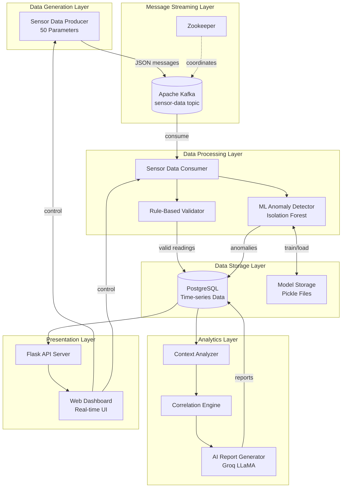
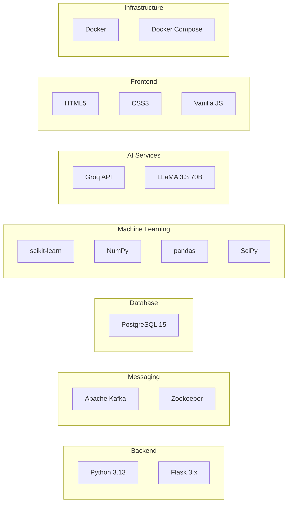
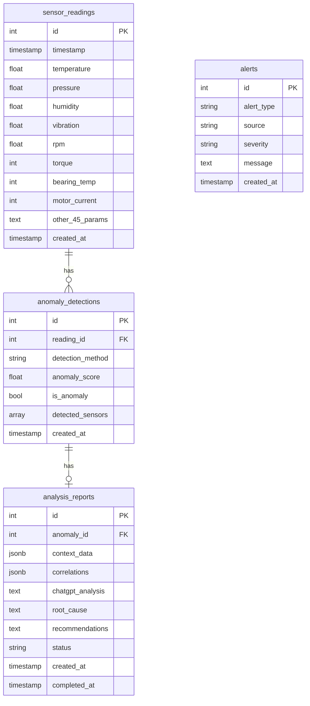
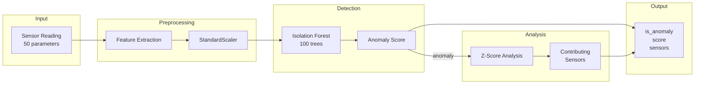
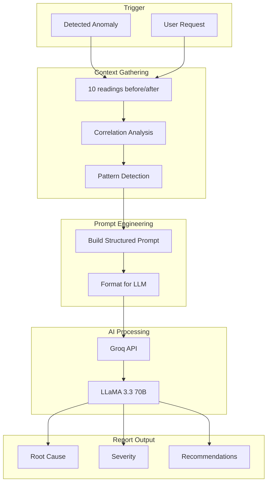
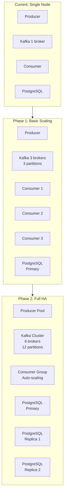

# Sensor Data Pipeline
## High-Level Architecture & Product Development Plan

**Version:** 1.0  
**Last Updated:** December 2024  
**Author:** Development Team

---

## Table of Contents

1. [Executive Summary](#1-executive-summary)
2. [Product Vision](#2-product-vision)
3. [System Architecture](#3-system-architecture)
4. [Technology Stack](#4-technology-stack)
5. [Core Components](#5-core-components)
6. [Data Architecture](#6-data-architecture)
7. [ML & AI Pipeline](#7-ml--ai-pipeline)
8. [Development Phases](#8-development-phases)
9. [Deployment Strategy](#9-deployment-strategy)
10. [Security Considerations](#10-security-considerations)
11. [Scalability Roadmap](#11-scalability-roadmap)
12. [Future Enhancements](#12-future-enhancements)

---

## 1. Executive Summary

### What We Built

The **Sensor Data Pipeline** is an end-to-end industrial IoT monitoring solution that:

- **Ingests** real-time sensor data from 50 parameters across 5 categories
- **Streams** data reliably through Apache Kafka message broker
- **Stores** readings in PostgreSQL with full historical retention
- **Detects** anomalies using Isolation Forest machine learning
- **Analyzes** patterns with statistical correlation engines
- **Reports** insights via AI-powered natural language analysis (Groq/LLaMA)
- **Visualizes** everything through a modern, real-time web dashboard

### Key Metrics

| Metric | Value |
|--------|-------|
| Sensor Parameters | 50 |
| Sensor Categories | 5 (Environmental, Mechanical, Thermal, Electrical, Fluid) |
| Data Throughput | 1 reading/second (configurable) |
| ML Detection Latency | <100ms per reading |
| Dashboard Refresh Rate | 2 seconds |
| AI Report Generation | 30-60 seconds |

---

## 2. Product Vision

### Problem Statement

Industrial facilities need continuous monitoring of equipment health to:
- Prevent unexpected failures and downtime
- Optimize maintenance schedules
- Ensure safety compliance
- Reduce operational costs

Traditional monitoring systems lack:
- Real-time anomaly detection
- Cross-sensor correlation analysis
- Intelligent root cause identification
- Actionable, human-readable insights

### Solution

A modern, ML-powered monitoring platform that:

```
┌─────────────────────────────────────────────────────────────────┐
│                    SENSOR DATA PIPELINE                         │
├─────────────────────────────────────────────────────────────────┤
│                                                                  │
│   ┌──────────┐    ┌───────┐    ┌──────────┐    ┌──────────┐    │
│   │  Sensors │───▶│ Kafka │───▶│ Consumer │───▶│ Database │    │
│   │ (50 params)   │       │    │   + ML   │    │          │    │
│   └──────────┘    └───────┘    └────┬─────┘    └────┬─────┘    │
│                                     │               │           │
│                                     ▼               ▼           │
│                              ┌──────────┐    ┌──────────┐       │
│                              │ Anomaly  │    │    AI    │       │
│                              │ Detector │───▶│ Analyzer │       │
│                              └──────────┘    └────┬─────┘       │
│                                                   │              │
│                                                   ▼              │
│                                            ┌──────────┐         │
│                                            │Dashboard │         │
│                                            │   UI     │         │
│                                            └──────────┘         │
│                                                                  │
└─────────────────────────────────────────────────────────────────┘
```

### Target Users

| User Type | Primary Use Case |
|-----------|-----------------|
| **Plant Operators** | Real-time monitoring, alerts |
| **Maintenance Engineers** | Anomaly investigation, reports |
| **Reliability Engineers** | Trend analysis, predictive maintenance |
| **Plant Managers** | KPI dashboards, compliance reports |

---

## 3. System Architecture

### High-Level Architecture Diagram



### Architectural Principles

| Principle | Implementation |
|-----------|---------------|
| **Loose Coupling** | Kafka decouples producer from consumer |
| **Exactly-Once Semantics** | Manual offset commit after DB write |
| **Graceful Degradation** | AI fallback when API unavailable |
| **Horizontal Scalability** | Kafka partitions, multiple consumers |
| **Fault Tolerance** | Exponential backoff, retry logic |

---

## 4. Technology Stack

### Core Technologies



### Detailed Stack

| Layer | Technology | Version | Purpose |
|-------|------------|---------|---------|
| **Runtime** | Python | 3.13 | Core application language |
| **Web Framework** | Flask | 3.x | REST API and dashboard server |
| **Message Broker** | Apache Kafka | 7.5.0 | Real-time data streaming |
| **Coordination** | Zookeeper | 7.5.0 | Kafka cluster management |
| **Database** | PostgreSQL | 15 | Time-series data storage |
| **DB Driver** | psycopg2 | 2.9.x | PostgreSQL Python adapter |
| **ML Framework** | scikit-learn | 1.3.x | Anomaly detection models |
| **Data Processing** | pandas/NumPy | 2.x/1.26 | Data manipulation |
| **Statistics** | SciPy | 1.11 | Correlation analysis |
| **AI API** | OpenAI SDK | 1.x | Groq API client |
| **AI Model** | LLaMA 3.3 | 70B | Natural language analysis |
| **Containerization** | Docker | Latest | Service isolation |
| **Orchestration** | Docker Compose | v2 | Multi-container management |

### Dependency Management

```
requirements.txt
├── kafka-python==2.0.2      # Kafka client
├── psycopg2-binary==2.9.9   # PostgreSQL driver
├── flask==3.0.0             # Web framework
├── requests==2.31.0         # HTTP client
├── scikit-learn==1.3.2      # ML algorithms
├── numpy==1.26.2            # Numerical computing
├── pandas==2.1.3            # Data analysis
├── scipy==1.11.4            # Scientific computing
├── joblib==1.3.2            # Model serialization
└── openai==1.3.0            # Groq API client
```

---

## 5. Core Components

### 5.1 Sensor Data Producer (`producer.py`)

**Responsibility:** Generate realistic, correlated sensor data

```
┌─────────────────────────────────────────────────────────────┐
│                    SensorDataProducer                        │
├─────────────────────────────────────────────────────────────┤
│ Attributes:                                                  │
│   - producer: KafkaProducer                                 │
│   - message_count: int                                      │
│   - should_shutdown: bool                                   │
│   - custom_thresholds: dict                                 │
├─────────────────────────────────────────────────────────────┤
│ Key Methods:                                                 │
│   + connect_to_kafka() → KafkaProducer                      │
│   + generate_sensor_reading() → dict                        │
│   + generate_anomalous_reading() → dict                     │
│   + check_injection_settings() → bool                       │
│   + send_message(data) → bool                               │
│   + run() → main loop                                       │
└─────────────────────────────────────────────────────────────┘
```

**Features:**
- Correlated sensor values (RPM affects temperature, vibration, etc.)
- Configurable duration and interval
- Anomaly injection via dashboard API
- Graceful shutdown on signals
- Exponential backoff for connection retries

### 5.2 Sensor Data Consumer (`consumer.py`)

**Responsibility:** Process messages, store data, trigger ML detection

```
┌─────────────────────────────────────────────────────────────┐
│                    SensorDataConsumer                        │
├─────────────────────────────────────────────────────────────┤
│ Attributes:                                                  │
│   - consumer: KafkaConsumer                                 │
│   - db_conn: PostgreSQL Connection                          │
│   - message_count: int                                      │
│   - should_shutdown: bool                                   │
├─────────────────────────────────────────────────────────────┤
│ Key Methods:                                                 │
│   + connect_to_kafka() → KafkaConsumer                      │
│   + connect_to_database() → (conn, cursor)                  │
│   + validate_message(data) → bool                           │
│   + detect_anomalies(reading) → list  [Rule-based]          │
│   + insert_reading(reading) → int                           │
│   + run_ml_detection(reading, id) → None                    │
│   + process_message(message) → bool                         │
└─────────────────────────────────────────────────────────────┘
```

**Processing Pipeline:**
1. Poll Kafka for messages
2. Validate JSON structure
3. Rule-based anomaly check (range validation)
4. Insert into PostgreSQL
5. Trigger ML detection
6. Commit Kafka offset (exactly-once)

### 5.3 ML Anomaly Detector (`ml_detector.py`)

**Responsibility:** Machine learning-based outlier detection

```
┌─────────────────────────────────────────────────────────────┐
│                    AnomalyDetector                           │
├─────────────────────────────────────────────────────────────┤
│ Algorithm: Isolation Forest                                  │
│ Training: Auto-train on MIN_TRAINING_SAMPLES (100+)         │
│ Features: All 50 sensor parameters                          │
│ Output: (is_anomaly, score, contributing_sensors)           │
├─────────────────────────────────────────────────────────────┤
│ Key Methods:                                                 │
│   + train(data) → bool                                      │
│   + detect(reading) → (bool, float, list)                   │
│   + _identify_contributing_sensors() → list                 │
│   + retrain_if_needed() → bool                              │
└─────────────────────────────────────────────────────────────┘
```

**Algorithm Details:**
- **Isolation Forest:** Unsupervised anomaly detection
- **Contamination:** 5% expected anomaly rate
- **Trees:** 100 estimators
- **Scoring:** Lower score = more anomalous
- **Contributing Sensors:** Z-score analysis (>2σ deviation)

### 5.4 Context Analyzer (`analysis_engine.py`)

**Responsibility:** Analyze patterns around detected anomalies

```
┌─────────────────────────────────────────────────────────────┐
│                    ContextAnalyzer                           │
├─────────────────────────────────────────────────────────────┤
│ Window Size: 10 readings before/after anomaly               │
│ Correlation: Pearson with p-value filtering                 │
│ Pattern Detection: Z-score deviation analysis               │
├─────────────────────────────────────────────────────────────┤
│ Key Methods:                                                 │
│   + get_context_window(reading_id) → dict                   │
│   + compute_correlations(context) → dict                    │
│   + identify_anomalous_patterns(context) → dict             │
│   + generate_analysis_summary(reading_id) → dict            │
└─────────────────────────────────────────────────────────────┘
```

### 5.5 AI Report Generator (`report_generator.py`)

**Responsibility:** Generate human-readable analysis using LLM

```
┌─────────────────────────────────────────────────────────────┐
│                    ReportGenerator                           │
├─────────────────────────────────────────────────────────────┤
│ AI Provider: Groq (LLaMA 3.3 70B)                           │
│ Prompt Engineering: Structured industrial analysis          │
│ Fallback: Automated report when API unavailable             │
├─────────────────────────────────────────────────────────────┤
│ Report Sections:                                             │
│   1. Root Cause Analysis                                    │
│   2. Affected Systems                                       │
│   3. Severity Assessment                                    │
│   4. Prevention Recommendations                             │
│   5. Immediate Actions Required                             │
└─────────────────────────────────────────────────────────────┘
```

### 5.6 Web Dashboard (`dashboard.py` + `dashboard.html`)

**Responsibility:** User interface and process control

**Backend Features:**
- REST API endpoints (20+)
- Process management (start/stop producer/consumer)
- Kafka health monitoring
- Configuration management
- Data export (CSV)

**Frontend Features:**
- Real-time stats updates (2s polling)
- Sensor readings by category
- Anomaly list with report generation
- Threshold customization
- Anomaly injection controls
- Full session report generation
- PDF/Text download

---

## 6. Data Architecture

### Database Schema



### Data Flow

```
Producer                    Kafka                    Consumer
   │                          │                          │
   │  JSON Message            │                          │
   │  {                       │                          │
   │    timestamp: "...",     │                          │
   │    temperature: 85.2,    │                          │
   │    pressure: 12.5,       │                          │
   │    ... (50 params)       │                          │
   │  }                       │                          │
   │ ──────────────────────▶  │                          │
   │                          │  ─────────────────────▶  │
   │                          │                          │
   │                          │                     ┌────┴────┐
   │                          │                     │Validate │
   │                          │                     └────┬────┘
   │                          │                          │
   │                          │                     ┌────┴────┐
   │                          │                     │ Insert  │
   │                          │                     │   DB    │
   │                          │                     └────┬────┘
   │                          │                          │
   │                          │                     ┌────┴────┐
   │                          │                     │   ML    │
   │                          │                     │ Detect  │
   │                          │                     └────┬────┘
   │                          │                          │
   │                          │  ◀─────────────────────  │
   │                          │     Commit Offset        │
```

---

## 7. ML & AI Pipeline

### Anomaly Detection Pipeline



### AI Report Generation Pipeline



### Model Training Strategy

| Aspect | Strategy |
|--------|----------|
| **Initial Training** | Auto-train when MIN_TRAINING_SAMPLES (100) reached |
| **Model Persistence** | Saved to `models/isolation_forest.pkl` |
| **Incremental Learning** | Retrain when new data significantly increases |
| **Feature Engineering** | All 50 parameters normalized with StandardScaler |
| **Contamination Tuning** | Default 5%, adjustable via config |

---

## 8. Development Phases

### Phase 1: Foundation ✅ COMPLETE

**Duration:** 2 weeks

| Deliverable | Status |
|-------------|--------|
| Kafka + PostgreSQL Docker setup | ✅ |
| Basic producer with 5 sensors | ✅ |
| Consumer with DB persistence | ✅ |
| Minimal Flask dashboard | ✅ |

### Phase 2: Enhanced Monitoring ✅ COMPLETE

**Duration:** 2 weeks

| Deliverable | Status |
|-------------|--------|
| Expand to 50 sensor parameters | ✅ |
| Sensor categories (5 groups) | ✅ |
| Rule-based anomaly detection | ✅ |
| Alert system | ✅ |
| Real-time dashboard updates | ✅ |

### Phase 3: ML Integration ✅ COMPLETE

**Duration:** 3 weeks

| Deliverable | Status |
|-------------|--------|
| Isolation Forest implementation | ✅ |
| Auto-training pipeline | ✅ |
| Contributing sensor identification | ✅ |
| anomaly_detections table | ✅ |
| ML stats in dashboard | ✅ |

### Phase 4: AI Analysis ✅ COMPLETE

**Duration:** 2 weeks

| Deliverable | Status |
|-------------|--------|
| Context analyzer | ✅ |
| Correlation engine | ✅ |
| Groq/LLaMA integration | ✅ |
| Per-anomaly reports | ✅ |
| Full session reports | ✅ |
| Fallback report generation | ✅ |

### Phase 5: Advanced Features ✅ COMPLETE

**Duration:** 2 weeks

| Deliverable | Status |
|-------------|--------|
| Custom threshold configuration | ✅ |
| Anomaly injection controls | ✅ |
| CSV data export | ✅ |
| Report download (PDF/TXT) | ✅ |
| Comprehensive documentation | ✅ |

### Phase 6: Production Readiness 🔄 PLANNED

**Duration:** 3 weeks

| Deliverable | Status |
|-------------|--------|
| Authentication/Authorization | 📋 Planned |
| HTTPS/TLS encryption | 📋 Planned |
| Kubernetes deployment manifests | 📋 Planned |
| Prometheus metrics | 📋 Planned |
| Grafana dashboards | 📋 Planned |
| Load testing | 📋 Planned |

---

## 9. Deployment Strategy

### Current: Development Environment

```
┌─────────────────────────────────────────────────────────────┐
│                    Developer Machine                         │
├─────────────────────────────────────────────────────────────┤
│                                                              │
│  ┌──────────────────────┐    ┌──────────────────────────┐  │
│  │   Python venv        │    │   Docker Compose         │  │
│  │                      │    │                          │  │
│  │  - dashboard.py      │    │  - Kafka (9092)          │  │
│  │  - producer.py       │◀──▶│  - Zookeeper (2181)      │  │
│  │  - consumer.py       │    │  - PostgreSQL (5432)     │  │
│  │  - ML modules        │    │                          │  │
│  └──────────────────────┘    └──────────────────────────┘  │
│                                                              │
│  Browser ──▶ http://localhost:5000                          │
│                                                              │
└─────────────────────────────────────────────────────────────┘
```

### Target: Production Environment

```
┌─────────────────────────────────────────────────────────────┐
│                    Kubernetes Cluster                        │
├─────────────────────────────────────────────────────────────┤
│                                                              │
│  ┌─────────────┐  ┌─────────────┐  ┌─────────────┐         │
│  │  Dashboard  │  │  Producer   │  │  Consumer   │         │
│  │  (3 replicas)│  │  (1 pod)    │  │  (3 replicas)│        │
│  └──────┬──────┘  └──────┬──────┘  └──────┬──────┘         │
│         │                │                │                  │
│         ▼                ▼                ▼                  │
│  ┌─────────────────────────────────────────────────┐        │
│  │              Kafka Cluster (3 brokers)           │        │
│  └─────────────────────────────────────────────────┘        │
│                          │                                   │
│                          ▼                                   │
│  ┌─────────────────────────────────────────────────┐        │
│  │         PostgreSQL (Primary + Replicas)          │        │
│  └─────────────────────────────────────────────────┘        │
│                                                              │
│  ┌─────────────┐  ┌─────────────┐  ┌─────────────┐         │
│  │  Ingress    │  │ Prometheus  │  │  Grafana    │         │
│  │  (HTTPS)    │  │ (Metrics)   │  │ (Dashboards)│         │
│  └─────────────┘  └─────────────┘  └─────────────┘         │
│                                                              │
└─────────────────────────────────────────────────────────────┘
```

### Deployment Checklist

| Item | Development | Production |
|------|-------------|------------|
| **Python Runtime** | venv | Docker container |
| **Kafka** | Single broker | 3+ broker cluster |
| **PostgreSQL** | Single instance | Primary + replicas |
| **Dashboard** | Flask dev server | Gunicorn + Nginx |
| **Secrets** | Environment vars | Kubernetes Secrets |
| **TLS** | None | Let's Encrypt / cert-manager |
| **Auth** | None | OAuth2 / OIDC |
| **Monitoring** | Logs only | Prometheus + Grafana |

---

## 10. Security Considerations

### Current Security Model

| Area | Current State | Risk Level |
|------|--------------|------------|
| Authentication | None | 🔴 High |
| Authorization | None | 🔴 High |
| TLS/HTTPS | None | 🔴 High |
| API Keys | Environment vars | 🟡 Medium |
| DB Credentials | Config file | 🟡 Medium |
| Input Validation | Basic | 🟢 Low |

### Recommended Security Enhancements

1. **Authentication**
   - Implement OAuth2/OIDC
   - Session management
   - Password policies

2. **Authorization**
   - Role-based access control (RBAC)
   - Operator vs. Admin roles
   - API key scoping

3. **Network Security**
   - TLS everywhere
   - Network policies (Kubernetes)
   - Firewall rules

4. **Data Protection**
   - Encrypt sensitive data at rest
   - Audit logging
   - Data retention policies

5. **Secret Management**
   - Use Vault or Kubernetes Secrets
   - Rotate credentials regularly
   - Never commit secrets

---

## 11. Scalability Roadmap

### Horizontal Scaling Strategy



### Scaling Metrics

| Metric | Current | Phase 1 | Phase 2 |
|--------|---------|---------|---------|
| Messages/sec | 1 | 100 | 10,000+ |
| Kafka Brokers | 1 | 3 | 6+ |
| Kafka Partitions | 1 | 3 | 12+ |
| Consumer Instances | 1 | 3 | Auto-scale |
| DB Read Replicas | 0 | 0 | 2+ |
| Dashboard Replicas | 1 | 2 | 3+ |

### Performance Optimizations

1. **Batch Processing**
   - Batch DB inserts
   - Batch Kafka commits
   - Connection pooling

2. **Caching**
   - Redis for session data
   - Cache ML model in memory
   - Cache frequent queries

3. **Async Processing**
   - Background ML training
   - Async report generation
   - Queue for AI API calls

---

## 12. Future Enhancements

### Short-Term (3-6 months)

| Feature | Priority | Effort |
|---------|----------|--------|
| Email/SMS alerts | High | Medium |
| Historical trend charts | High | Medium |
| LSTM Autoencoder for sequences | Medium | High |
| Multi-tenant support | Medium | High |
| Mobile-responsive dashboard | Medium | Low |

### Medium-Term (6-12 months)

| Feature | Priority | Effort |
|---------|----------|--------|
| Predictive maintenance models | High | High |
| Integration with SCADA/PLC | High | High |
| Custom ML model upload | Medium | Medium |
| Report scheduling (daily/weekly) | Medium | Low |
| Webhook integrations | Medium | Low |

### Long-Term (12+ months)

| Feature | Priority | Effort |
|---------|----------|--------|
| Edge computing support | High | Very High |
| Digital twin integration | Medium | Very High |
| AR/VR maintenance guidance | Low | Very High |
| Federated learning | Low | High |
| Natural language querying | Medium | High |

### Technology Radar

```
                    ADOPT                    TRIAL                    ASSESS
    ┌─────────────────────────────────────────────────────────────────────────┐
    │                                                                          │
    │  Kafka ●                        Kafka Connect ●                          │
    │  PostgreSQL ●                   InfluxDB ●           TimescaleDB ●       │
    │  Isolation Forest ●             LSTM ●               Transformers ●      │
    │  Flask ●                        FastAPI ●            gRPC ●              │
    │  Docker ●                       Kubernetes ●         Serverless ●        │
    │  Groq/LLaMA ●                   Local LLMs ●         Claude ●            │
    │                                                                          │
    └─────────────────────────────────────────────────────────────────────────┘
```

---

## Appendix A: API Reference

See full API documentation in the dashboard or [`docs/uml_diagrams.md`](uml_diagrams.md#api-endpoint-summary).

## Appendix B: Configuration Reference

See `config.py` for all configurable parameters.

## Appendix C: UML Diagrams

See [`docs/uml_diagrams.md`](uml_diagrams.md) for comprehensive diagrams:
- Component diagrams
- Sequence diagrams
- Class diagrams
- State machines
- Activity diagrams
- Database ERD

---

*Document maintained by the Development Team. Last updated December 2024.*

