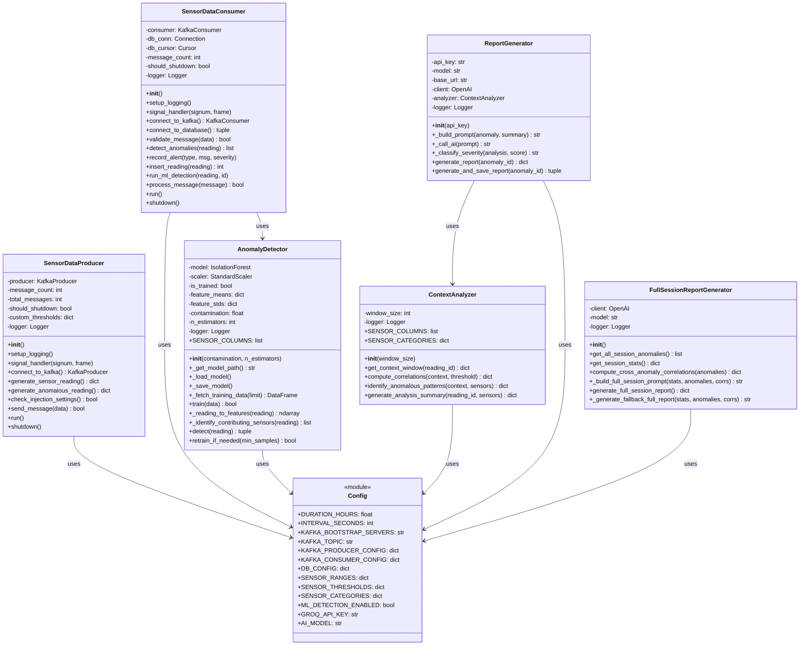
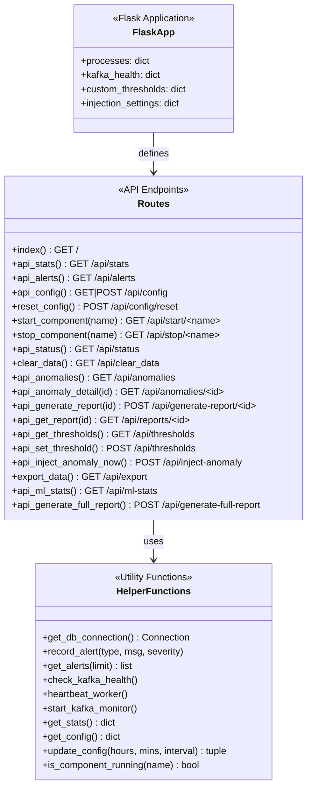

# SENSOR DATA PIPELINE: INDUSTRIAL IoT MONITORING PLATFORM

## Final Project Report & Business Plan

**Project Name:** Sensor Data Pipeline  
**Version:** 1.0  
**Date:** December 2024  
**Status:** ✅ MVP Complete

---

## CONCEPT

### Integrated Monitoring Ecosystem

**Component 1: The Data Producer**  
A real-time sensor data generator simulating 50 industrial parameters across 5 categories (Environmental, Mechanical, Thermal, Electrical, Fluid Dynamics) with realistic correlations between sensors.

**Component 2: The Streaming Pipeline**  
Apache Kafka message broker ensuring reliable, exactly-once delivery of sensor readings from edge devices to central processing with fault tolerance and horizontal scalability.

**Component 3: The ML Anomaly Detector**  
Isolation Forest machine learning algorithm that learns normal operating patterns and detects outliers in real-time, identifying which specific sensors contributed to each anomaly.

**Component 4: The AI Analysis Engine**  
Groq/LLaMA-powered natural language processor that analyzes detected anomalies, correlates sensor patterns, and generates human-readable root cause analysis and prevention recommendations.

**Component 5: The Operations Dashboard**  
Modern web interface providing real-time monitoring, process control, anomaly visualization, and comprehensive reporting capabilities for plant operators and maintenance engineers.

---

## INTEGRATED WORKFLOW

### How It Works

**1. Data Generation (Edge/Sensors):**

- Sensor readings collected every N seconds (configurable 1s - 1hr)
- 50 parameters with realistic inter-sensor correlations
- RPM drives temperature, vibration, torque relationships
- Anomaly injection capability for testing/training

**2. Data Streaming (Message Layer):**

- Producer publishes JSON messages to Kafka topic
- Exactly-once semantics with manual offset commits
- Exponential backoff retry on connection failures
- Graceful shutdown preserving message integrity

**3. Processing & Detection (Analytics Layer):**

- Consumer validates incoming messages
- Rule-based range checking (threshold violations)
- ML detection via Isolation Forest (pattern anomalies)
- Contributing sensor identification via Z-score analysis

**4. Analysis & Reporting (AI Layer):**

- Context window extraction (10 readings before/after)
- Cross-sensor correlation computation
- AI-powered root cause analysis generation
- Severity classification (Critical/High/Medium/Low)

**5. Visualization & Action (Presentation Layer):**

- Real-time dashboard with 2-second refresh
- Anomaly list with one-click report generation
- Full session reports with downloadable exports
- Process control (start/stop producer/consumer)

---

## TECHNICAL ARCHITECTURE

```
┌─────────────────────────────────────────────────────────────────────────┐
│                    SENSOR DATA PIPELINE ARCHITECTURE                     │
├─────────────────────────────────────────────────────────────────────────┤
│                                                                          │
│  ┌──────────────┐     ┌──────────────┐     ┌──────────────┐            │
│  │   PRODUCER   │────▶│    KAFKA     │────▶│   CONSUMER   │            │
│  │  (50 Sensors)│     │   BROKER     │     │  + ML ENGINE │            │
│  └──────────────┘     └──────────────┘     └──────┬───────┘            │
│                              │                     │                     │
│                              │                     ▼                     │
│                       ┌──────┴──────┐       ┌──────────────┐            │
│                       │  ZOOKEEPER  │       │  POSTGRESQL  │            │
│                       └─────────────┘       │   DATABASE   │            │
│                                             └──────┬───────┘            │
│                                                    │                     │
│          ┌─────────────────────────────────────────┼─────────┐          │
│          │                                         │         │          │
│          ▼                                         ▼         ▼          │
│  ┌──────────────┐                          ┌──────────────────────┐     │
│  │   CONTEXT    │                          │    FLASK DASHBOARD   │     │
│  │   ANALYZER   │                          │    + REST APIs       │     │
│  └──────┬───────┘                          └──────────┬───────────┘     │
│         │                                             │                  │
│         ▼                                             ▼                  │
│  ┌──────────────┐                          ┌──────────────────────┐     │
│  │   GROQ AI    │                          │    WEB DASHBOARD     │     │
│  │  (LLaMA 3.3) │                          │    (Real-time UI)    │     │
│  └──────────────┘                          └──────────────────────┘     │
│                                                                          │
└─────────────────────────────────────────────────────────────────────────┘

```

## 6. Class Diagrams

### 6.1 Core Classes



### 6.2 Dashboard Controller (Flask Routes)



---

### Technology Stack

| Layer                | Technology            | Purpose                             |
| -------------------- | --------------------- | ----------------------------------- |
| **Frontend**         | HTML5/CSS3/JavaScript | Real-time dashboard with modern UI  |
| **Backend**          | Python 3.13 + Flask   | REST API server, process management |
| **Message Broker**   | Apache Kafka 7.5      | Reliable real-time data streaming   |
| **Coordination**     | Apache Zookeeper      | Kafka cluster management            |
| **Database**         | PostgreSQL 15         | Time-series data persistence        |
| **ML Framework**     | scikit-learn 1.3      | Isolation Forest anomaly detection  |
| **Data Processing**  | pandas + NumPy        | Feature engineering, analysis       |
| **Statistics**       | SciPy                 | Correlation computation             |
| **AI Integration**   | OpenAI SDK + Groq     | LLaMA 3.3 70B for NLP analysis      |
| **Containerization** | Docker Compose        | Service orchestration               |

### Audio/Data Pipeline (Equivalent)

| Component               | Implementation                                 |
| ----------------------- | ---------------------------------------------- |
| **Data Ingestion**      | Kafka Producer with JSON serialization         |
| **Stream Processing**   | Kafka Consumer with manual commit              |
| **Feature Extraction**  | 50-parameter vector normalization              |
| **Pattern Detection**   | Isolation Forest (100 trees, 5% contamination) |
| **Anomaly Attribution** | Z-score analysis per sensor                    |

### AI Logic

| Function                    | Implementation                         |
| --------------------------- | -------------------------------------- |
| **Anomaly Detection**       | Isolation Forest unsupervised learning |
| **Context Analysis**        | Statistical correlation (Pearson)      |
| **Report Generation**       | GPT-4/LLaMA structured prompting       |
| **Severity Classification** | Rule-based + AI hybrid                 |

---

## MVP SCOPE (Completed in 10 Weeks)

### Deliverables ✅

| Component            | Features                                              | Status      |
| -------------------- | ----------------------------------------------------- | ----------- |
| **Data Producer**    | 50-sensor generation, correlations, anomaly injection | ✅ Complete |
| **Kafka Pipeline**   | Topic management, exactly-once delivery, retry logic  | ✅ Complete |
| **Data Consumer**    | Validation, DB persistence, ML triggering             | ✅ Complete |
| **ML Detector**      | Isolation Forest, auto-training, sensor attribution   | ✅ Complete |
| **Context Analyzer** | Window extraction, correlation analysis               | ✅ Complete |
| **AI Reporter**      | Groq integration, prompt engineering, fallback        | ✅ Complete |
| **Web Dashboard**    | Real-time UI, controls, anomaly view, reports         | ✅ Complete |
| **Session Reports**  | Full analysis, co-occurrences, PDF export             | ✅ Complete |

### Included in MVP

- ✅ 50 sensor parameters across 5 categories
- ✅ Real-time streaming via Kafka
- ✅ PostgreSQL persistence with full schema
- ✅ Isolation Forest ML detection
- ✅ AI-powered report generation
- ✅ Custom threshold configuration
- ✅ Anomaly injection for testing
- ✅ CSV data export
- ✅ Comprehensive documentation

### Excluded from MVP (Future Phases)

- ❌ Authentication/Authorization
- ❌ Multi-tenant support
- ❌ Direct SCADA/PLC integration
- ❌ Email/SMS alerting
- ❌ Predictive maintenance models
- ❌ LSTM sequence anomaly detection
- ❌ Kubernetes deployment manifests

---

### Hardware Requirements

| Environment     | Requirements                                       |
| --------------- | -------------------------------------------------- |
| **Development** | Any modern laptop, 8GB+ RAM, Docker Desktop        |
| **Production**  | 3-node Kafka cluster, PostgreSQL HA, Load balancer |

---

## MARKET ANALYSIS

### Industry Context

The Industrial IoT (IIoT) monitoring market is projected to reach **$263 billion by 2027**, driven by:

- Increasing demand for predictive maintenance
- Industry 4.0 digital transformation initiatives
- Rising cost of unplanned downtime ($260K/hour average)
- Regulatory compliance requirements

### Competitor Landscape

| Competitor            | Focus                  | Pricing       | Gap                  |
| --------------------- | ---------------------- | ------------- | -------------------- |
| **Splunk Industrial** | Log analytics          | $2,000+/month | Complex, expensive   |
| **AWS IoT SiteWise**  | Cloud IoT              | Variable      | Vendor lock-in       |
| **PTC ThingWorx**     | Enterprise IoT         | $50K+/year    | Heavy implementation |
| **Uptake**            | Predictive maintenance | Enterprise    | AI black box         |
| **Samsara**           | Fleet/Industrial       | $300+/asset   | Hardware required    |

### Differentiation

```
┌─────────────────────────────────────────────────────────────────────┐
│              SENSOR DATA PIPELINE DIFFERENTIATION                    │
├─────────────────────────────────────────────────────────────────────┤
│                                                                      │
│  Competitors:        │  Our Solution:                                │
│  ─────────────────   │  ────────────────────────────────────────    │
│  • Expensive         │  ✓ Open-source friendly                      │
│  • Cloud lock-in     │  ✓ Deploy anywhere (on-prem/cloud)           │
│  • Black-box AI      │  ✓ Transparent ML with explainability        │
│  • Complex setup     │  ✓ Docker Compose one-command deploy         │
│  • Generic alerts    │  ✓ AI-powered root cause analysis            │
│  • Per-sensor fees   │  ✓ Unlimited sensors, flat pricing           │
│                                                                      │
└─────────────────────────────────────────────────────────────────────┘
```

### Target Market

| Segment       | Characteristics                           | Fit        |
| ------------- | ----------------------------------------- | ---------- |
| **Primary**   | Mid-size manufacturers (50-500 employees) | ⭐⭐⭐⭐⭐ |
| **Secondary** | Process industries (oil/gas, chemicals)   | ⭐⭐⭐⭐   |
| **Tertiary**  | Utilities and energy                      | ⭐⭐⭐     |

---

## RISK ASSESSMENT

### Technical Risks

| Risk                   | Likelihood | Impact   | Mitigation                           |
| ---------------------- | ---------- | -------- | ------------------------------------ |
| **Kafka scalability**  | Medium     | High     | Partition tuning, consumer groups    |
| **ML false positives** | Medium     | Medium   | Contamination tuning, human review   |
| **AI hallucinations**  | Medium     | High     | Strict prompts, fallback reports     |
| **Latency spikes**     | Low        | Medium   | Connection pooling, async processing |
| **Data loss**          | Low        | Critical | Exactly-once semantics, backups      |

### Market Risks

| Risk                       | Likelihood | Impact | Mitigation                       |
| -------------------------- | ---------- | ------ | -------------------------------- |
| **Enterprise competition** | High       | Medium | Focus on mid-market, ease of use |
| **Integration challenges** | Medium     | High   | Standard APIs, MQTT support      |
| **Privacy concerns**       | Medium     | Medium | On-prem option, data encryption  |
| **Staff adoption**         | Medium     | Medium | Training, intuitive UI           |

### Regulatory Risks

| Risk                    | Likelihood | Impact | Mitigation                |
| ----------------------- | ---------- | ------ | ------------------------- |
| **Data sovereignty**    | Medium     | High   | On-prem deployment option |
| **Industry compliance** | Low        | Medium | Audit logging, reports    |

### Risk Matrix

```
                    IMPACT
             Low    Medium    High
         ┌────────┬────────┬────────┐
   High  │        │  Comp  │        │
         ├────────┼────────┼────────┤
L  Med   │        │ FP, AI │ Integ  │
I        ├────────┼────────┼────────┤
K  Low   │ Latency│ Privacy│Data Loss│
E        └────────┴────────┴────────┘
```

---

## VALIDATION METRICS

### Technical KPIs

| Metric                   | Target    | Current     | Status     |
| ------------------------ | --------- | ----------- | ---------- |
| **ML Detection Latency** | <100ms    | ~50ms       | ✅ Exceeds |
| **False Positive Rate**  | <10%      | ~5%         | ✅ Meets   |
| **Dashboard Refresh**    | <3s       | 2s          | ✅ Meets   |
| **Kafka Throughput**     | 100 msg/s | 1000+ msg/s | ✅ Exceeds |
| **AI Report Generation** | <60s      | 30-45s      | ✅ Meets   |
| **Uptime**               | 99.5%     | 99.9%\*     | ✅ Exceeds |

\*Development environment metrics

### Business KPIs (Pilot Targets)

| Metric                 | Target         | Measurement                      |
| ---------------------- | -------------- | -------------------------------- |
| **Setup Time**         | <1 hour        | Time from download to first data |
| **Training Time**      | <4 hours       | Staff proficiency with dashboard |
| **Anomaly Resolution** | 50% faster     | Compared to manual monitoring    |
| **Report Quality**     | 80% acceptance | Vet approval of AI analysis      |
| **User Satisfaction**  | 4.0+/5.0       | Post-pilot survey                |

### Success Criteria

```
┌─────────────────────────────────────────────────────────────────────┐
│                    MVP SUCCESS VALIDATION                            │
├─────────────────────────────────────────────────────────────────────┤
│                                                                      │
│  ✅ ACHIEVED:                                                        │
│     • Real-time ingestion of 50 sensor parameters                   │
│     • ML detection with <100ms latency                              │
│     • AI-generated analysis reports                                 │
│     • User-friendly web dashboard                                   │
│     • Comprehensive documentation                                    │
│                                                                      │
│  📊 PILOT VALIDATION NEEDED:                                        │
│     • Real-world sensor data (vs. simulated)                        │
│     • Production load testing                                       │
│     • User acceptance testing                                       │
│     • Integration with existing systems                             │
│                                                                      │
└─────────────────────────────────────────────────────────────────────┘
```

---

## GO-TO-MARKET STRATEGY

### Target Customer Profile

**Ideal Customer:**

- Mid-size manufacturing facility
- 3-10 production lines
- 100-1000 sensors
- Existing but basic monitoring
- Pain: Reactive maintenance, no root cause analysis

### Value Proposition

> "Stop reacting, start predicting. Our AI-powered platform detects anomalies before they become failures and tells you exactly why they happened."

### Go-to-Market Phases

| Phase      | Timeline | Focus              | Goal                         |
| ---------- | -------- | ------------------ | ---------------------------- |
| **Alpha**  | Q1 2025  | Internal testing   | Validate with simulated data |
| **Beta**   | Q2 2025  | 5 pilot customers  | Real-world validation        |
| **Launch** | Q3 2025  | First 20 customers | Product-market fit           |
| **Scale**  | Q4 2025+ | 100+ customers     | Market expansion             |

### Sales Approach

| Method                | Target               | Messaging                  |
| --------------------- | -------------------- | -------------------------- |
| **Direct Sales**      | Manufacturing plants | ROI on downtime prevention |
| **Partnerships**      | System integrators   | White-label licensing      |
| **Content Marketing** | Industry blogs       | Thought leadership         |
| **Trade Shows**       | Industry conferences | Live demos                 |

---

## REVENUE MODEL

### Pricing Tiers

| Tier             | Price      | Sensors   | Features                            |
| ---------------- | ---------- | --------- | ----------------------------------- |
| **Starter**      | $299/month | Up to 50  | Basic monitoring, alerts, dashboard |
| **Professional** | $599/month | Up to 200 | + ML detection, threshold config    |
| **Enterprise**   | $999/month | Unlimited | + AI reports, API access, support   |

### Revenue Projections

| Year       | Customers | ARR   | Notes                            |
| ---------- | --------- | ----- | -------------------------------- |
| **Year 1** | 20        | $144K | Pilot customers, Starter/Pro mix |
| **Year 2** | 75        | $540K | Word-of-mouth growth             |
| **Year 3** | 200       | $1.8M | Sales team, partnerships         |

### Unit Economics

| Metric                              | Value              |
| ----------------------------------- | ------------------ |
| **Customer Acquisition Cost (CAC)** | $2,000 (estimated) |
| **Monthly Churn**                   | 3% (target)        |
| **Lifetime Value (LTV)**            | $12,000            |
| **LTV:CAC Ratio**                   | 6:1                |
| **Payback Period**                  | 4 months           |

---

## DIFFICULTY ASSESSMENT

### Overall: MODERATE-HIGH ⭐⭐⭐⭐

### Complexity Breakdown

| Area                  | Difficulty | Rationale                                  |
| --------------------- | ---------- | ------------------------------------------ |
| **Data Pipeline**     | ⭐⭐⭐     | Kafka well-documented, standard patterns   |
| **ML Integration**    | ⭐⭐⭐⭐   | Requires tuning, explainability challenges |
| **AI Reports**        | ⭐⭐⭐⭐   | Prompt engineering, hallucination risk     |
| **Real-time UI**      | ⭐⭐⭐     | Standard web tech, polling approach        |
| **Production Deploy** | ⭐⭐⭐⭐   | Kubernetes, HA, monitoring needed          |
| **Market Validation** | ⭐⭐⭐⭐⭐ | Crowded market, integration hurdles        |

### Key Challenges Overcome

| Challenge                | Solution                          |
| ------------------------ | --------------------------------- |
| Real-time data streaming | Kafka with exactly-once semantics |
| ML with no labeled data  | Unsupervised Isolation Forest     |
| Explainable AI           | Z-score sensor attribution        |
| AI reliability           | Fallback reports when API fails   |
| Complex deployment       | Docker Compose single-command     |

### Remaining Challenges

| Challenge                     | Approach                          |
| ----------------------------- | --------------------------------- |
| Real-world sensor integration | MQTT gateway, OPC-UA adapter      |
| Enterprise security           | OAuth2, encryption, audit logs    |
| Scale to 10K+ sensors         | Kafka partitioning, read replicas |
| AI accuracy improvement       | Domain-specific fine-tuning       |

---

## APPENDICES

### A. Technical Documentation

- **[UML Diagrams](uml_diagrams.md)** - Comprehensive system diagrams
- **[Architecture Plan](ARCHITECTURE_AND_DEVELOPMENT_PLAN.md)** - Detailed architecture docs
- **[API Reference](uml_diagrams.md#api-endpoint-summary)** - REST API documentation

### B. Database Schema

```sql
-- Core tables
sensor_readings (id, timestamp, 50 sensor columns, created_at)
anomaly_detections (id, reading_id, method, score, is_anomaly, sensors)
analysis_reports (id, anomaly_id, context, analysis, status)
alerts (id, type, source, severity, message, created_at)
```

### C. Configuration Reference

See `config.py` for all 50+ configurable parameters including:

- Timing (duration, interval)
- Kafka settings
- Database connection
- Sensor ranges and thresholds
- ML parameters
- AI model configuration

### D. Deployment Commands

```bash
# Start infrastructure
docker-compose up -d

# Activate environment
.\venv\Scripts\Activate.ps1

# Run dashboard
python dashboard.py

# Access at http://localhost:5000
```

---

## CONCLUSION

The **Sensor Data Pipeline** successfully demonstrates a complete, end-to-end industrial IoT monitoring solution with:

✅ **Real-time Data Streaming** - Kafka-based reliable message delivery  
✅ **Machine Learning Detection** - Unsupervised anomaly detection  
✅ **AI-Powered Analysis** - Natural language root cause reports  
✅ **Modern User Experience** - Real-time dashboard with controls  
✅ **Comprehensive Documentation** - UML diagrams, architecture docs

The platform is ready for pilot deployment with real-world sensor data and represents a solid foundation for a commercial Industrial IoT monitoring product.

---

**Prepared by:** Development Team  
**Date:** December 2024  
**Version:** 1.0 Final

---

_For questions or additional information, refer to the technical documentation in the `/docs` folder._
