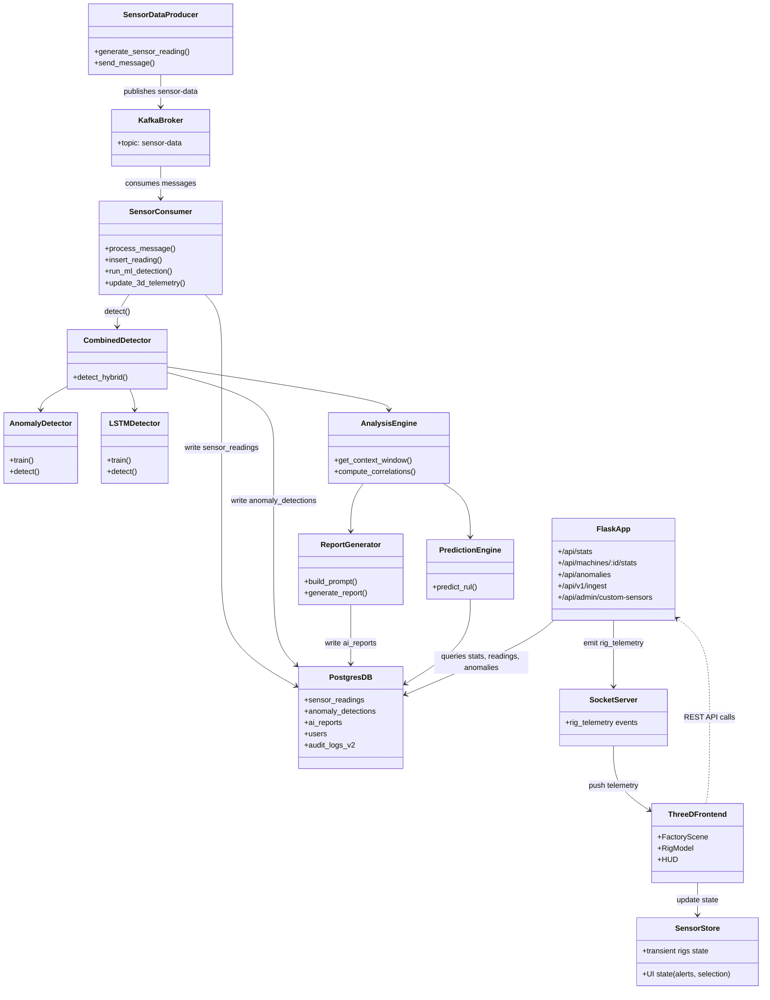

## Rig Alpha – Final Summary Report (Concise)

### 1. What Rig Alpha Is

Rig Alpha is an **end-to-end Industrial IoT monitoring and predictive maintenance platform** for factory and process equipment. It:
- **Collects** real-time data from 50+ industrial sensors (environmental, mechanical, thermal, electrical, fluid).
- **Streams** data through **Apache Kafka** with exactly-once delivery semantics.
- **Detects anomalies** using a **hybrid ML approach** (Isolation Forest for point anomalies + LSTM autoencoder for sequence/temporal anomalies).
- **Predicts failures** via **Remaining Useful Life (RUL)** estimation.
- **Analyzes root causes** and generates **AI-written reports** using **Groq-hosted LLaMA models**.
- **Visualizes** machine health in both a classic web dashboard and a **3D digital twin** built with React Three Fiber.
- **Logs and audits** all user and system actions for compliance.

Rig Alpha behaves like a 24/7 expert maintenance engineer and data scientist watching every critical parameter, warning you early, and explaining what’s happening in plain language.

---

### 2. Why It Was Built & Business Impact

Modern industrial plants have thousands of sensors and complex machines where:
- **Downtime is extremely expensive** (hundreds of thousands of dollars per hour).
- **Reactive maintenance** (waiting for failure) causes emergency repairs, cascading damage, and lost production.
- **Time-based preventive maintenance** often replaces healthy parts too early, while still missing unexpected failures.

Rig Alpha implements **Condition-Based Monitoring (CBM)** and **Predictive Maintenance (PdM)**:
- Uses real sensor data instead of fixed calendars.
- Detects early patterns of degradation (vibration, temperature rise, pressure changes, etc.).
- Predicts when components are likely to fail so maintenance can be scheduled in planned downtime.

Typical improvements (based on industry benchmarks documented in the project):
- **30–50% reduction** in maintenance costs.
- **20–40% increase** in equipment lifespan.
- Up to **70% reduction** in unplanned downtime.
- Example medium factory: **$300k–$500k/year** in savings plus better safety, quality, and employee well‑being.

---

### 3. Who It Serves & How It Helps

- **Factory Operators**
  - Simple **Green/Yellow/Red health indicators** per machine and sensor group.
  - Clear alerts with guidance on whether to keep running or stop.
  - Fewer 3 AM emergency callouts; issues are caught during normal shifts.

- **Maintenance Engineers**
  - **Detailed anomaly and trend reports** with top contributing sensors and correlations.
  - Know **which component is failing, why, and how soon**, before opening a panel.
  - Access to full sensor histories, anomaly detections, RUL estimates, and audit trails.

- **Plant Managers / Executives**
  - Executive dashboard with **KPIs**, downtime and anomaly statistics, and machine‑level status.
  - Visibility into **cost of failures vs. cost of interventions** and compliance evidence.

- **Developers & Integrators**
  - Fully open, documented codebase (Python + JavaScript/React).
  - Modular architecture: producer, Kafka streaming, consumer + ML, analysis engine, AI report generator, dashboard API, and 3D frontend.
  - Easy to extend with **custom sensors**, new ML models, or additional integrations.

---

### 4. Core Technologies & Architecture

Rig Alpha follows a **layered architecture**:

1. **Edge / Producer Layer**
   - `producer.py` simulates 50+ sensors with realistic **correlated behavior**:
     - **Environmental**: temperature, pressure, humidity, air quality, CO₂, noise, light, etc.
     - **Mechanical**: vibration, RPM, torque, shaft alignment, bearing temperature, motor current, belt tension, etc.
     - **Thermal**: coolant, exhaust, oil, core and surface temps, thermal efficiency.
     - **Electrical**: voltage, current, power factor, frequency, harmonics, ground fault.
     - **Fluid**: flow rate, fluid pressure, viscosity, Reynolds number, pump efficiency, valve position, etc.
   - Sensor values are **physically consistent** (e.g., higher RPM → higher temperature, vibration, and current; low lubrication pressure → rising bearing temp and vibration).
   - Supports **custom sensors** defined at runtime (stored in DB and added to each reading under a `custom_sensors` JSONB field).
   - Includes **anomaly injection** (manual, scheduled, or API‑driven) to simulate realistic faults for testing.

2. **Streaming Layer (Apache Kafka)**
   - All readings go to a `sensor-data` topic on Kafka (local Docker or cloud via Upstash).
   - **Producer config**: `acks='all'`, retries with **exponential backoff**, `max_in_flight_requests_per_connection=1` to preserve ordering.
   - **Consumer config**: manual offset commits (`enable_auto_commit=False`), `auto_offset_reset='earliest'`, and consumer groups for horizontal scaling.
   - Provides **exactly-once processing** when combined with idempotent DB writes and manual offset commits.

3. **Processing & ML Layer (Consumers + Anomaly Detection)**
   - `consumer.py` pipeline:
     - Decode & validate messages (required core fields like timestamp, temperature, pressure, humidity, vibration, RPM).
     - **Rule-based checks** against configured safe thresholds (e.g., bearing_temp > 180°F, impossible pressures) for immediate safety alerts.
     - **Insert all 50 sensor values + custom_sensors into PostgreSQL** in a single atomic transaction.
     - **Run ML detection**:
       - **Isolation Forest** (`ml_detector.py`) for point anomalies:
         - Trained on historical normal data (100+ samples).
         - 100 trees, 5% contamination; uses `StandardScaler` and stored feature means/stds for later z‑score analysis.
       - **LSTM Autoencoder** (`lstm_detector.py`) for sequence anomalies:
         - Analyzes last **20 readings × 50 features**.
         - Encoder–decoder LSTM architecture with a 32‑dimensional bottleneck.
         - Trained only on normal sequences; high reconstruction error = anomaly.
       - **Hybrid strategy** (`combined_pipeline.py`), default **`hybrid_smart`**:
         - Run Isolation Forest first; if it flags an anomaly, alert immediately.
         - If Isolation Forest says normal, run LSTM to catch **gradual or contextual** issues.
     - Store ML results in `anomaly_detections` (method, score, contributing sensors, timestamp).
     - Push a **telemetry update** to the dashboard for the 3D twin.
     - **Commit Kafka offset only after successful DB write**, enabling exactly‑once semantics.

4. **Storage Layer (PostgreSQL / Neon.tech)**
   - Core tables include:
     - `sensor_readings`: main time‑series of all 50 core sensors + `custom_sensors` (JSONB).
     - `anomaly_detections`: ML results linked to readings.
     - `ai_reports`: AI‑generated root cause and recommendation text per anomaly.
     - `users`, `alerts`, `custom_sensors`, `audit_logs_v2` (full compliance logging).
   - Uses **connection pooling** (`ThreadedConnectionPool` 5–50 connections) for performance.
   - **JSONB** enables flexible custom sensors per deployment while remaining queryable.
   - Supports both **local Postgres** and **Neon.tech serverless Postgres** via `DATABASE_URL` and SSL.

5. **AI Analysis & Reporting Layer**
   - `analysis_engine.py` builds a **context window** around each anomaly (10 readings before + anomaly + 10 after) and computes:
     - Significant **sensor correlations** (with p‑values).
     - **Z‑scores** for each sensor to highlight the largest deviations.
     - Recognizable failure patterns (e.g., lubrication loss → bearing_temp ↑, vibration ↑, lubrication_pressure ↓).
   - `report_generator.py` builds a rich **prompt** for Groq‑hosted **LLaMA** models:
     - Includes detection method and score, top deviating sensors, correlations, and context.
     - Asks for structured sections: **Root Cause, Affected Systems, Severity, Recommendations, Immediate Actions**.
   - Uses Groq via an OpenAI‑compatible API (`llama-3.3-70b-versatile` for detailed reports; smaller models for fast parsing).
   - If the AI API is unavailable, a **deterministic fallback** generates a data‑driven report directly from z‑scores and correlations.

6. **Presentation Layer (Dashboard + 3D Digital Twin)**
   - **Flask Dashboard (`dashboard.py`)**:
     - Classic web UI showing system stats, recent anomalies, per‑machine metrics, and controls.
     - **User authentication and RBAC**:
       - `users` table with `role` (`admin` / `operator`) and `machines_access`.
       - Session‑based auth with secure cookies and Content Security Policy (CSP) to reduce XSS/CSRF risks.
     - **REST API** for:
       - Stats and machine‑specific data (`/api/stats`, `/api/machines/<id>/stats`, `/api/anomalies`).
       - Admin functions for **custom sensors** and **AI sensor spec parsing** from uploaded files.
       - External **ingestion endpoint** (`/api/v1/ingest`) protected by an API key for real hardware integration.
     - **Audit logging** (`audit_logs_v2`):
       - Logs user, role, IP, user agent, action type, resource, previous/new state, timestamp, and retention period.
   - **3D Digital Twin Frontend (`frontend-3d/`)**:
     - Built with **React 18**, **React Three Fiber**, **Three.js**, **Zustand**, and **Socket.IO**.
     - First‑person 3D scene with **three machines (A, B, C)**, environment, lights, and effects (bloom, vignette).
     - Real‑time telemetry:
       - Flask broadcasts `rig_telemetry` events at ~10 Hz via Socket.IO.
       - Frontend `useSocket` hook updates **transient state** in a plain JS object (no React re‑render on every tick).
       - `useFrame` in `RigModel` reads transient state at 60 FPS and maps sensors to visuals:
         - **RPM → fan/turbine rotation speed**.
         - **Temperature → emissive color & glow** (black → red → orange/yellow).
         - **Vibration → rig shake** amplitude.
         - **Anomaly score → warning lights and particle effects**.
     - HUD overlays show machine IDs, status, and key metrics; WASD + mouse controls via Pointer Lock API.

#### 4.1 High-Level Class Diagram

The following diagram summarizes the main backend and frontend components and how they interact:

---

### 5. How It’s Used (Operations & Workflows)

- **Getting Started**
  - Use Docker Compose to launch Kafka, Zookeeper, and PostgreSQL.
  - Install Python dependencies (`requirements.txt`) and Node.js packages for the 3D frontend.
  - Run `train_combined_detector.py` once to generate initial Isolation Forest and LSTM models from normal data.
  - Start `dashboard.py`, `producer.py`, `consumer.py`, and `frontend-3d` dev server; open the dashboard (`:5000`) and 3D twin (`:3000`).

- **Day-to-Day Monitoring**
  - Operators watch the dashboard’s **health cards and telemetry grid**, plus the 3D rigs for intuitive status.
  - When anomalies occur:
    - Rule-based checks and ML detectors create alerts and anomaly records.
    - Operators see color changes, warning icons, and can request an **AI analysis report**.
    - Maintenance teams use these reports + trend plots to plan inspections and parts replacement.

- **Extending & Integrating**
  - Add new sensors via the **Custom Sensors** admin UI or API; values appear in `custom_sensors` and are used by detection.
  - Ingest real plant data by posting to `/api/v1/ingest` instead of (or in addition to) the simulator.
  - Deploy to cloud using **Neon.tech** (Postgres) and **Upstash** (Kafka), with the Flask app hosted on platforms like Render and the 3D frontend on Vercel/Netlify.

---

### 6. Big Picture Takeaways

- Rig Alpha shows **a full, realistic industrial data pipeline**: from sensor generation to streaming, ML, AI, storage, dashboards, and 3D visualization.
- The system is designed around **reliability (exactly‑once processing, ACID DB, audit logs)** and **explainability** (z‑scores, correlations, AI narratives).
- The **hybrid anomaly detection** (Isolation Forest + LSTM) and **RUL prediction** provide both fast alerts and foresight into slowly developing problems.
- With its open, modular architecture and strong documentation (00–08), Rig Alpha can be:
  - A teaching tool for industrial IoT and MLOps concepts.
  - A foundation for real plant integrations.
  - A portfolio‑grade demonstration of full‑stack, data‑driven industrial engineering.

