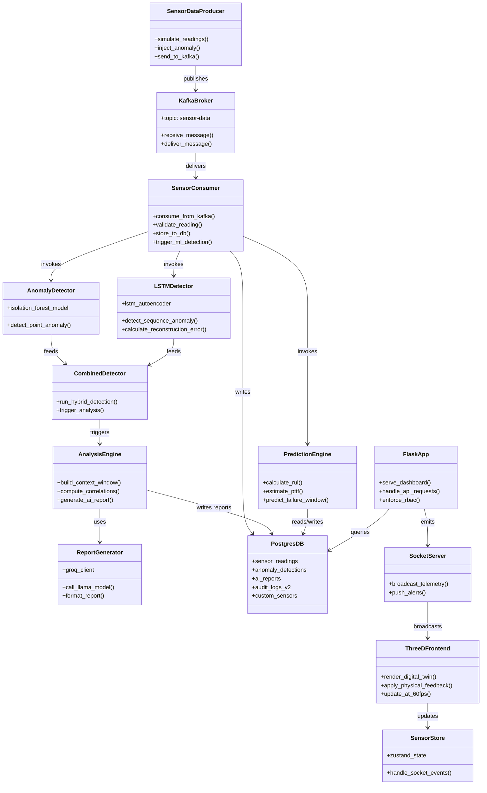

# Rig Alpha – Final Summary Report

## 1. What Rig Alpha Is

Rig Alpha is an **end-to-end Industrial IoT monitoring and predictive maintenance platform** for factory and process equipment. It:
- **Collects** real-time data from 50+ industrial sensors (environmental, mechanical, thermal, electrical, fluid).
- **Streams** data through **Apache Kafka** with exactly-once delivery semantics.
- **Detects anomalies** using a **hybrid ML approach** (Isolation Forest for point anomalies + LSTM autoencoder for sequence/temporal anomalies).
- **Predicts failures** via **Remaining Useful Life (RUL)** and **Time-to-Failure (PTTF)** countdowns.
- **Analyzes root causes** and generates **AI-written reports** using **Groq-hosted LLaMA models**.
- **Automates Onboarding** via **AI Smart Onboarding**, parsing PDF/CSV sensor specs to auto-configure rig parameters.
- **Visualizes** machine health in a high-fidelity "Dark Mode" web dashboard and a **3D digital twin** built with React Three Fiber.
- **Logs and audits** all user and system actions with a tamper-evident cloud-based audit trail.

Rig Alpha behaves like a 24/7 expert maintenance engineer and data scientist watching every critical parameter, warning you early, and explaining what's happening in plain language.

---

## 2. Why It Was Built & Business Impact

Modern industrial plants have thousands of sensors and complex machines where:
- **Downtime is extremely expensive** (hundreds of thousands of dollars per hour).
- **Reactive maintenance** (waiting for failure) causes emergency repairs, cascading damage, and lost production.
- **Time-based preventive maintenance** often replaces healthy parts too early, while still missing unexpected failures.

Rig Alpha implements **Condition-Based Monitoring (CBM)** and **Predictive Maintenance (PdM)**:
- Uses real sensor data instead of fixed calendars.
- Detects early patterns of degradation (vibration, temperature rise, pressure changes, etc.).
- Predicts when components are likely to fail so maintenance can be scheduled in planned downtime.

**Typical Business Impact:**
- **30–50% reduction** in maintenance costs.
- **20–40% increase** in equipment lifespan.
- Up to **70% reduction** in unplanned downtime.
- Example medium factory: **$300k–$500k/year** in savings plus better safety.

---

## 3. Who It Serves & How It Helps

### Factory Operators
- **High-Contrast "Dark Mode" UI:** Optimized for control rooms with a "Zero-Scroll" layout using **Gridstack** (configurable drag-and-drop tiles).
- **Live Telemetry:** Real-time Message Velocity (MPS), sparklines for trends, and simple **Green/Yellow/Red** health indicators.
- **Visual Alarms:** Full-screen alerts and PTTF countdowns allow operators to see risks immediately without digging into data.

### Maintenance Engineers
- **Detailed Anomaly Reports:** AI-generated narratives explaining root causes (e.g., "Lubrication loss causing bearing overheat").
- **Forensics:** Access to full sensor histories, anomaly detections, RUL estimates, and audit trails.
- **3D Digital Twin:** Provides immediate physical context (e.g., which specific motor is vibrating).

### Plant Managers / Executives
- **Executive Dashboard:** KPIs, downtime/anomaly statistics, and machine‑level status (Isolation of Machine A/B/C).
- **ROI Tracking:** Visibility into cost of failures vs. cost of interventions.

### Developers & Integrators
- **Open Architecture:** Modular codebase (Python + React) featuring **Ithena branding** elements.
- **AI Smart Onboarding:** Drag-and-drop sensor spec sheets (PDF/CSV) to auto-map parameters using LLMs.
- **Universal Ingest:** "Universal Alias Mapping" simplifies integration with legacy hardware that uses non-standard naming.

---

## 4. Core Technologies & Architecture

Rig Alpha follows a **layered architecture**:

### 1. Edge / Producer Layer
- **Simulation:** `producer.py` simulates 50+ sensors with realistic correlated behavior (e.g., higher RPM → higher Temp/Vibration).
- **Universal Ingest:** Supports legacy hardware integration via alias mapping through `/api/v1/ingest`.
- **Anomaly Injection:** "Inject Anomaly NOW" button allows immediate testing of fault logic (manual, scheduled, or API‑driven).

### 2. Streaming Layer (Apache Kafka)
- **Topic:** `sensor-data` (Local Docker or Cloud via Upstash).
- **Reliability:** `acks='all'`, retries with exponential backoff, and `max_in_flight_requests_per_connection=1` to preserve ordering.
- **Semantics:** Provides **exactly-once processing** when combined with idempotent DB writes and manual offset commits.

### 3. Processing & ML Layer (Consumers + Anomaly Detection)
- **Pipeline:**
  - Decode & validate messages.
  - **Rule-based checks** against configured safe thresholds (min/max limits for all 50 parameters).
  - **Atomic DB Writes:** Inserts 50+ sensor values in a single transaction.
  - **ML Detection:**
    - **Isolation Forest:** For point anomalies.
    - **LSTM Autoencoder:** For sequence/temporal anomalies (last 20 readings) to detect subtle time-based patterns and provide early warning.
    - **Hybrid Strategy:** Combines speed of Forest with context of LSTM.
  - **RUL Engine:** Computes "Time-to-Failure" (PTTF) based on degradation velocity.
  - **Telemetry Push:** Updates the 3D twin via Socket.IO.

### 4. Storage Layer (PostgreSQL / Neon.tech)
- **Cloud-Native Serverless:** Migrated to **Neon.tech** for serverless scaling and global accessibility.
- **Tables:** `sensor_readings`, `anomaly_detections`, `ai_reports`, `users`, `alerts`, `custom_sensors`, `audit_logs_v2`.
- **Thread Safety:** Implemented `ThreadedConnectionPool` (5–50 connections) and component locking logic to prevent leaks during high-velocity bursts.

### 5. AI Analysis & Reporting Layer
- **Analysis Engine:** Builds a context window (pre/post anomaly) and computes correlations/Z-scores.
- **Generative AI:** Uses Groq‑hosted **LLaMA** models to write structured reports (Root Cause, Severity, Recommended Actions).
- **Smart Onboarding:** Parses unstructured PDF/CSV/JSON manuals to auto-configure sensor metadata (units, thresholds, categories).

### 6. Presentation Layer (Dashboard + 3D Digital Twin)

#### Flask Dashboard (`dashboard.py`)
- **Security:** 
  - `Flask-Limiter` (rate limiting: login 5/min, ingest 200/min)
  - `Flask-Talisman` (Content Security Policy)
  - Strict input sanitization with `.textContent` and float-casting to block XSS/corruption
  - Secure cookies
- **Industrial UX:** 
  - Dark mode optimized for control rooms
  - Persistent Gridstack layouts via localStorage
  - Sparklines for real-time trend visualization
  - "Zero-Scroll" high-density layout
- **Metrics:** 
  - Live CPU Load tracking
  - Database Latency monitoring (<100ms targets) in header
  - Message Velocity (MPS) display
- **RBAC & Auditing:** 
  - Strict Admin vs. Operator roles
  - SQL-backed **Audit Log V2** tracks every state change with immutable timestamps
  - Machine-specific access control (assign operators to Machine A, B, or C)
- **Custom Sensors:**
  - Admin can add dynamic custom parameters with metadata
  - Per-machine enable/disable configuration
  - Drag-and-drop sensor organization

#### 3D Digital Twin (`frontend-3d`)
- **Tech Stack:** React 18, React Three Fiber, Three.js, Zustand.
- **Physical Feedback:**
  - **Vibration → Jitter:** Model shakes dynamically based on sensor data.
  - **Temperature → Color:** Wireframe glows Red/Neon as heat rises > 80°F.
- **Performance:** Updates at 60 FPS using transient state (no React re-renders for telemetry).
- **Live Kafka Integration:** Real-time synchronization with cloud telemetry.

---

## 5. High-Level Class Diagram

Below is a simplified class diagram showing the main components and their relationships:

**Key Relationships:**
- **Producer → Kafka → Consumer**: Data ingestion pipeline with exactly-once semantics
- **Consumer → ML Models**: Hybrid anomaly detection (Isolation Forest + LSTM)
- **ML → Analysis Engine → LLM**: AI-powered root cause analysis
- **Flask API → Socket.IO → 3D Frontend**: Real-time visualization pipeline
- **All components → PostgresDB**: Centralized cloud storage (Neon)

---

## 6. How It's Used (Operations & Workflows)

### Getting Started & Configuration
1. **Smart Onboarding:** Admin uploads a sensor manual (PDF/CSV); AI parses specs and configures the DB.
2. **Machine Isolation:** Assign Operators to Machine A, B, or C via the Admin panel.
3. **Thresholds:** Adjust min/max limits or use the "Inject Anomaly" button to test system response.
4. **Custom Sensors:** Add new dynamic parameters via the Admin UI with drag-and-drop organization.

### Day-to-Day Monitoring
1. Operators watch the **"Control Tower" view** (Dark Mode with zero-scroll layout).
2. **3D Visualization:** If the digital twin shakes or glows red, operators know instantly there is a physical issue.
3. **Visual Alarms:** Full-screen warnings and PTTF countdowns trigger on critical faults.
4. **Live Metrics:** Monitor Message Velocity (MPS), CPU Load, and Database Latency in real-time.

### Anomaly Response Workflow
1. **Detection:** Hybrid ML (Isolation Forest + LSTM) flags anomaly.
2. **Analysis:** System correlates affected parameters and computes Z-scores.
3. **Report Generation:** Groq/LLaMA generates plain-language explanation with root cause and recommended actions.
4. **Prediction:** RUL engine estimates time-to-failure (PTTF countdown).
5. **Audit Trail:** All actions logged to `audit_logs_v2` with immutable timestamps.

### Extending & Integrating
1. Add new sensors via **Custom Sensors** admin UI or API.
2. Post data to `/api/v1/ingest` using legacy hardware aliases (Universal Alias Mapping).
3. Deploy globally using Neon (DB) and Upstash (Kafka) for cloud-native scalability.

---

## 7. Key Features Summary (Checklist from Development)

**Core Pipeline:**
- ✅ Threshold Alerts System (min/max safe limits for 50 parameters)
- ✅ ML Anomaly Detection with Isolation Forest
- ✅ LSTM Autoencoder for time-based pattern detection
- ✅ Groq/LLaMA AI-written reports (correlations, root cause, prevention)
- ✅ "Inject Anomaly NOW" button for testing

**Machine Management:**
- ✅ Machine isolation (A/B/C) with per-machine state
- ✅ Operator/Admin dashboard separation
- ✅ Per-machine sensor configuration
- ✅ Form-based authentication with RBAC

**Custom Sensors & Configuration:**
- ✅ Dynamic custom sensor support (add parameters at runtime)
- ✅ Drag-and-drop sensor organization
- ✅ Per-machine enable/disable for custom sensors
- ✅ AI Smart Onboarding (drag-and-drop PDF/CSV parsing)

**UI & Visualization:**
- ✅ High-contrast "Dark Mode" aesthetic for control rooms
- ✅ Persistent Gridstack layouts via localStorage
- ✅ Message Velocity (MPS) tracking
- ✅ Sparklines for trend visualization
- ✅ CPU Load and Database Latency metrics in header
- ✅ LSTM-driven visual alerts with PTTF countdown
- ✅ Full-screen visual alarms
- ✅ 3D Digital Twin with vibration jitter and thermal color-coding

**Security & Compliance:**
- ✅ Flask-Limiter rate limiting (login 5/min, ingest 200/min)
- ✅ Flask-Talisman CSP + secure cookies
- ✅ XSS protection (.textContent + float-casting)
- ✅ SQL-backed Audit Logs V2 (immutable, timestamped)

**Cloud & Scalability:**
- ✅ Cloud-Native Serverless Postgres (Neon) migration
- ✅ ThreadedConnectionPool for thread safety
- ✅ Component locking to prevent connection leaks
- ✅ Universal alias-mapping ingest for legacy hardware via `/api/v1/ingest`
- ✅ `/api/v1/predictive-health` endpoint for RUL data

**AI & Intelligence:**
- ✅ RUL (Remaining Useful Life) estimation
- ✅ PTTF (Predicted Time To Failure) countdown
- ✅ Groq/LLaMA sensor spec parsing from PDF/CSV/JSON
- ✅ Context-aware anomaly analysis with correlations

**Branding:**
- ✅ Ithena branding integration (logos, fonts, professional styling)

---

## 8. Big Picture Takeaways

- **Production-Grade Pipeline:** Rig Alpha is not just a demo; it handles real-time streaming, exactly-once processing, and thread-safe concurrency.
- **Hybrid Intelligence:** Combines statistical ML (Isolation Forest/LSTM) with Generative AI (LLaMA reports) for complete situational awareness.
- **Immersive UX:** The 3D Digital Twin translates complex data into immediate physical intuition (shake/glow).
- **Secure & Compliant:** Built with RBAC, Rate Limiting, CSP, and immutable Audit Logs for industrial environments.
- **Cloud-Native:** Fully migrated to serverless infrastructure (Neon DB) for global scalability.
- **AI-Powered Operations:** From Smart Onboarding to predictive maintenance reports, AI is embedded throughout the workflow.
- **Industrial-Grade UX:** Dark mode, zero-scroll layouts, and persistent configurations designed for 24/7 control room operations.

---

## 9. Technology Stack

**Backend:**
- Python 3.x
- Flask (web framework)
- Apache Kafka (streaming)
- PostgreSQL via Neon.tech (cloud database)
- psycopg2 with ThreadedConnectionPool
- Flask-SocketIO (real-time communication)
- Flask-Limiter (rate limiting)
- Flask-Talisman (security headers)

**Machine Learning:**
- scikit-learn (Isolation Forest)
- TensorFlow/Keras (LSTM Autoencoder)
- Groq API with LLaMA models (AI report generation)

**Frontend (Dashboard):**
- HTML5/CSS3/JavaScript
- Gridstack.js (drag-and-drop layouts)
- Chart.js (sparklines and visualizations)
- Socket.IO client (real-time updates)

**Frontend (3D Digital Twin):**
- React 18
- React Three Fiber
- Three.js
- Zustand (state management)
- Vite (build tool)

**Infrastructure:**
- Docker (Kafka, local development)
- Neon.tech (Serverless Postgres)
- Upstash (Cloud Kafka - optional)

---

## 10. Documentation & Resources

**Comprehensive Documentation:**
- `docs/comprehensive/00-MASTER-INDEX.md` - Complete project index
- `docs/comprehensive/01-CORE-CONCEPTS.md` - Core concepts and principles
- `docs/comprehensive/02-ARCHITECTURE.md` - System architecture
- `docs/comprehensive/03-SENSORS-REFERENCE.md` - All 50+ sensor parameters
- `docs/comprehensive/04-CODE-BACKEND.md` - Backend implementation details
- `docs/comprehensive/05-CODE-DASHBOARD.md` - Dashboard code walkthrough
- `docs/comprehensive/06-CODE-3D-FRONTEND.md` - 3D twin implementation
- `docs/comprehensive/07-HOW-TO-GUIDES.md` - Setup and operation guides
- `docs/comprehensive/08-REFERENCE-APPENDIX.md` - API reference and troubleshooting

**Quick Start:**
- `README.md` - Project overview and setup instructions
- `PROJECT_OVERVIEW.md` - High-level project description

**Architecture & Planning:**
- `docs/ARCHITECTURE_AND_DEVELOPMENT_PLAN.md`
- `docs/uml_diagrams.md`

---

**Developed by Arnav Golia & Rahul Bainsla**  
**Powered by Ithena**
