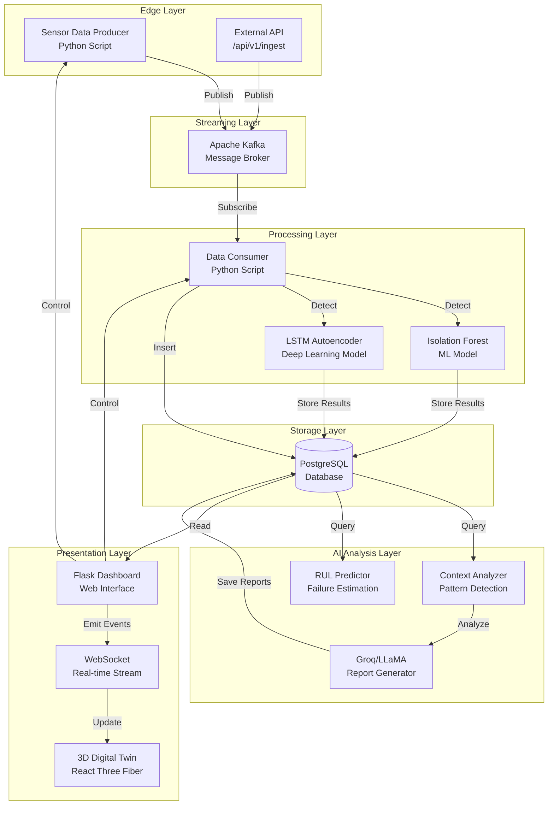
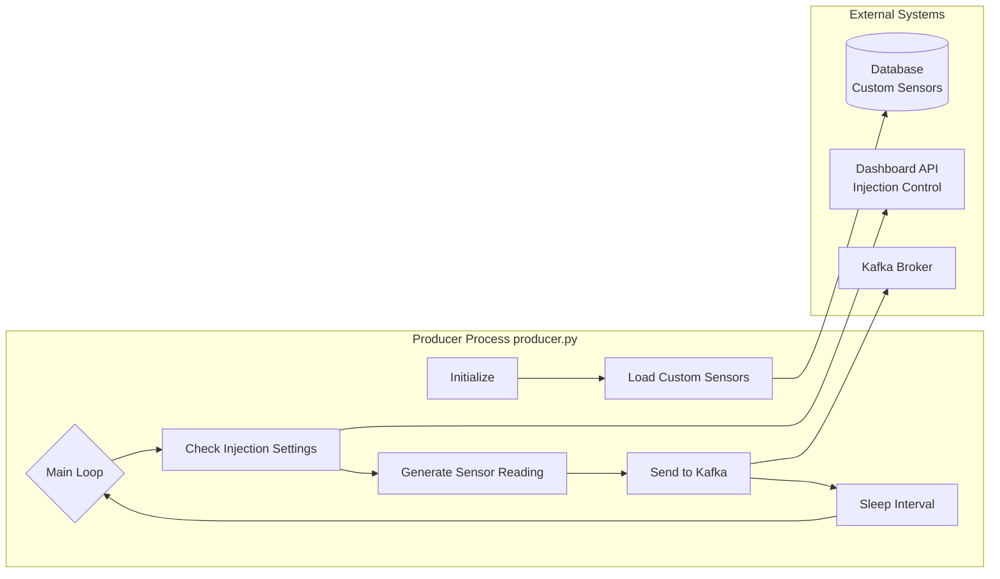
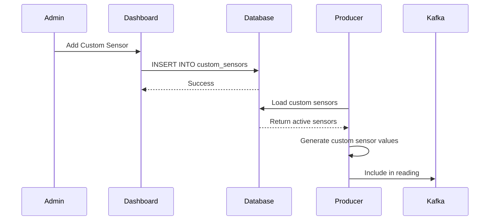
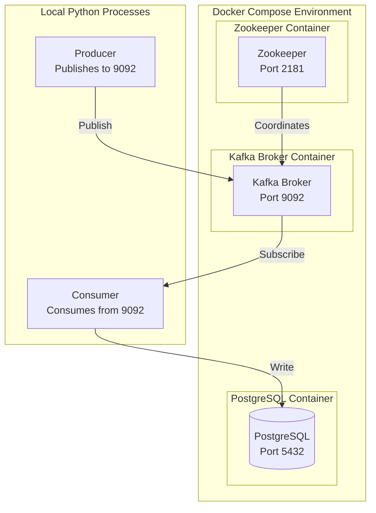
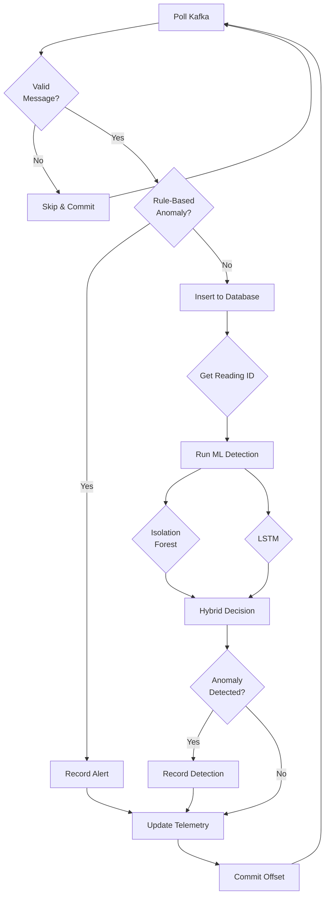
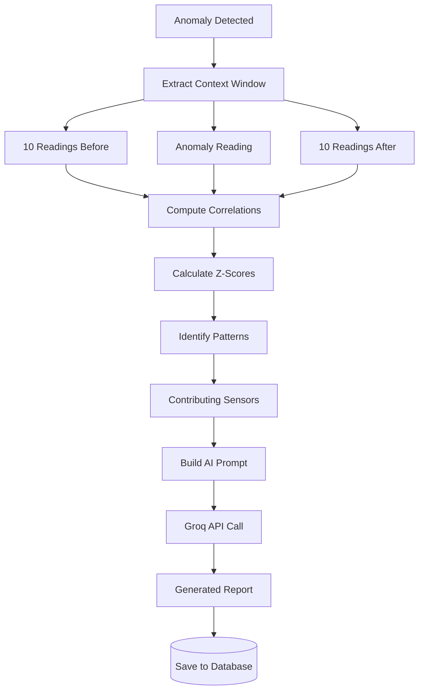
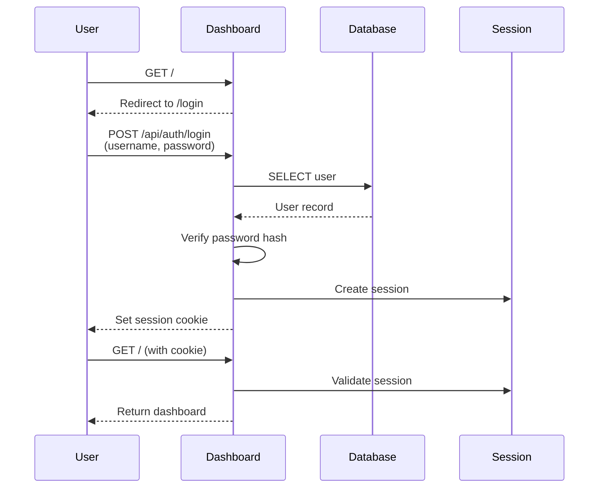

# SYSTEM ARCHITECTURE DEEP DIVE
## Understanding How Everything Works Together

**Document 02 of 09**  
**Reading Time:** 45-60 minutes  
**Level:** Intermediate to Advanced  
**Prerequisites:** Read Document 01 (Core Concepts) first

---

## 📋 TABLE OF CONTENTS

1. [High-Level Architecture](#1-high-level-architecture)
2. [Edge/Producer Layer](#2-edgeproducer-layer)
3. [Streaming Layer (Kafka)](#3-streaming-layer-kafka)
4. [Processing Layer](#4-processing-layer)
5. [Storage Layer (PostgreSQL)](#5-storage-layer-postgresql)
6. [AI Analysis Layer](#6-ai-analysis-layer)
7. [Presentation Layer](#7-presentation-layer)
8. [Data Flow Journey](#8-data-flow-journey)

---

## 1. HIGH-LEVEL ARCHITECTURE

### 1.1 The 30,000-Foot View

Rig Alpha is built as a **layered architecture** where each layer has specific responsibilities and communicates through well-defined interfaces.



### 1.2 Design Principles

**1. Separation of Concerns**
- Each layer has one primary responsibility
- Changes in one layer don't break others
- Easy to test and maintain

**2. Loose Coupling**
- Components communicate through Kafka (message queue)
- No direct dependencies between producer and consumer
- Can replace/upgrade components independently

**3. Scalability**
- Horizontal scaling (add more consumers)
- Kafka partitioning for parallelism
- Database connection pooling

**4. Fault Tolerance**
- Kafka stores messages if consumer fails
- Automatic retry with exponential backoff
- Graceful degradation (fallback reports if AI fails)

**5. Real-Time Processing**
- Sub-second latency from sensor to dashboard
- WebSocket for instant updates
- 60 FPS 3D rendering

### 1.3 Technology Stack Summary

| Layer | Technologies |
|-------|-------------|
| **Edge** | Python 3.13, Kafka Producer API |
| **Streaming** | Apache Kafka 3.x, Zookeeper |
| **Processing** | Python, scikit-learn, TensorFlow, NumPy |
| **Storage** | PostgreSQL 15+, Neon.tech (cloud) |
| **AI** | Groq API, LLaMA 3.3, OpenAI library |
| **Backend** | Flask 3.x, Flask-SocketIO, psycopg2 |
| **Frontend** | React 18, React Three Fiber, Zustand |
| **Infrastructure** | Docker, Docker Compose |

---

## 2. EDGE/PRODUCER LAYER

### 2.1 Purpose and Responsibilities

The **Edge Layer** is where sensor data originates. In production systems, this would be:
- Physical sensors on machinery
- IoT gateways collecting sensor readings
- PLC (Programmable Logic Controllers) outputs
- SCADA (Supervisory Control and Data Acquisition) systems

**In Rig Alpha:** We simulate this with `producer.py` - a Python script that generates realistic correlated sensor data.

### 2.2 Producer Architecture



### 2.3 Sensor Categories and Parameters

**All 50 sensors organized by category:**

#### **Environmental Sensors (10)**
Monitoring conditions in the surrounding environment:

| Sensor | Range | Unit | Why It Matters |
|--------|-------|------|----------------|
| `temperature` | 60-100 | °F | Core operating temp, affects all systems |
| `pressure` | 0-15 | PSI | Atmospheric/system pressure |
| `humidity` | 20-80 | % | Moisture affects equipment life |
| `ambient_temp` | 50-90 | °F | Room temperature context |
| `dew_point` | 30-70 | °F | Condensation risk indicator |
| `air_quality_index` | 0-500 | AQI | Contamination detection |
| `co2_level` | 400-2000 | ppm | Ventilation effectiveness |
| `particle_count` | 0-100000 | particles/m³ | Air cleanliness |
| `noise_level` | 40-110 | dB | Acoustic monitoring |
| `light_intensity` | 0-10000 | lux | Visibility conditions |

#### **Mechanical Sensors (10)**
Monitoring motion, force, and mechanical health:

| Sensor | Range | Unit | Why It Matters |
|--------|-------|------|----------------|
| `vibration` | 0-10 | mm/s | #1 indicator of mechanical issues |
| `rpm` | 1000-5000 | RPM | Rotational speed (drives all other parameters) |
| `torque` | 0-500 | Nm | Rotational force/load |
| `shaft_alignment` | -0.5 to 0.5 | mm | Misalignment causes premature failure |
| `bearing_temp` | 70-180 | °F | Bearing health indicator |
| `motor_current` | 0-100 | A | Motor load indicator |
| `belt_tension` | 20-100 | lbf | Drive belt condition |
| `gear_wear` | 0-100 | % | Gear degradation tracking |
| `coupling_temp` | 60-150 | °F | Coupling health |
| `lubrication_pressure` | 10-60 | PSI | Oil system pressure |

#### **Thermal Sensors (10)**
Monitoring heat and temperature distribution:

| Sensor | Range | Unit | Why It Matters |
|--------|-------|------|----------------|
| `coolant_temp` | 140-220 | °F | Cooling system effectiveness |
| `exhaust_temp` | 300-900 | °F | Combustion/process heat |
| `oil_temp` | 150-250 | °F | Lubricant temperature |
| `radiator_temp` | 150-230 | °F | Heat dissipation performance |
| `thermal_efficiency` | 60-95 | % | System efficiency metric |
| `heat_dissipation` | 0-5000 | W | Heat removal rate |
| `inlet_temp` | 50-120 | °F | Input temperature |
| `outlet_temp` | 80-200 | °F | Output temperature |
| `core_temp` | 140-240 | °F | Central component temp |
| `surface_temp` | 70-180 | °F | External temperature |

#### **Electrical Sensors (10)**
Monitoring electrical system health:

| Sensor | Range | Unit | Why It Matters |
|--------|-------|------|----------------|
| `voltage` | 110-130 | V | Power supply stability |
| `current` | 0-50 | A | Electrical load |
| `power_factor` | 0.7-1.0 | PF | Power efficiency |
| `frequency` | 59-61 | Hz | Grid stability |
| `resistance` | 0.1-100 | Ω | Circuit integrity |
| `capacitance` | 1-1000 | μF | Capacitor health |
| `inductance` | 0.1-10 | mH | Inductor characteristics |
| `phase_angle` | -180 to 180 | ° | Phase relationship |
| `harmonic_distortion` | 0-20 | % | Power quality |
| `ground_fault` | 0-100 | mA | Electrical safety |

#### **Fluid Dynamics Sensors (10)**
Monitoring fluid systems:

| Sensor | Range | Unit | Why It Matters |
|--------|-------|------|----------------|
| `flow_rate` | 0-500 | L/min | Fluid volume per time |
| `fluid_pressure` | 0-100 | PSI | Hydraulic system pressure |
| `viscosity` | 1-100 | cP | Fluid thickness |
| `density` | 0.5-1.5 | g/cm³ | Fluid density |
| `reynolds_number` | 2000-10000 | - | Flow regime indicator |
| `pipe_pressure_drop` | 0-50 | PSI | Pipe blockage indicator |
| `pump_efficiency` | 60-95 | % | Pump performance |
| `cavitation_index` | 0-10 | - | Cavitation risk |
| `turbulence` | 0-100 | % | Flow smoothness |
| `valve_position` | 0-100 | % | Valve opening percentage |

### 2.4 Sensor Correlation Logic

**Why Correlation Matters:**
Real sensors don't vary independently. For example:
- Higher RPM → Higher temperature
- Higher temperature → Lower humidity
- Higher current → More harmonic distortion

**Correlation Implementation:**

```python
# Example from producer.py

# 1. Start with RPM as base
rpm = random.uniform(1000, 5000)
rpm_normalized = (rpm - 1000) / 4000  # Scale to 0-1

# 2. Temperature correlates with RPM
temp_min = 60
temp_max = 100
temperature = temp_min + (rpm_normalized * (temp_max - temp_min))
temperature += random.uniform(-5, 5)  # Add noise
temperature = clamp(temperature, temp_min, temp_max)

# 3. Vibration correlates with RPM
vibration = 0 + (rpm_normalized * 10)
vibration += random.uniform(-1, 1)
vibration = clamp(vibration, 0, 10)

# 4. Current correlates with RPM and torque
torque = 100 + (rpm_normalized * 300)
motor_current = 20 + (rpm_normalized * 60)

# Result: Realistic correlated readings
# High RPM → High temp + High vibration + High current
```

**Correlation Matrix Example:**

| | RPM | Temp | Vibration | Current |
|---|-----|------|-----------|---------|
| **RPM** | 1.0 | 0.85 | 0.92 | 0.78 |
| **Temp** | 0.85 | 1.0 | 0.73 | 0.65 |
| **Vibration** | 0.92 | 0.73 | 1.0 | 0.58 |
| **Current** | 0.78 | 0.65 | 0.58 | 1.0 |

These realistic correlations help ML models learn true patterns.

### 2.5 Custom Sensors

**Feature:** Users can add their own sensors at runtime

**Storage:**
```sql
CREATE TABLE custom_sensors (
    id SERIAL PRIMARY KEY,
    sensor_name VARCHAR(64) UNIQUE,
    category VARCHAR(32),
    unit VARCHAR(16),
    min_range FLOAT,
    max_range FLOAT,
    low_threshold FLOAT,
    high_threshold FLOAT,
    is_active BOOLEAN DEFAULT TRUE
);
```

**Flow:**


**Example Reading with Custom Sensors:**
```json
{
  "timestamp": "2026-01-12T15:30:00",
  "temperature": 75.5,
  "pressure": 120.3,
  ...,
  "custom_sensors": {
    "oil_quality": 92.5,
    "filter_pressure_drop": 8.3,
    "custom_flow_meter_1": 245.7
  }
}
```

### 2.6 Anomaly Injection

**Purpose:** Test detection systems with simulated faults

**Trigger Methods:**
1. **Manual (Dashboard Button):** Immediate injection
2. **Scheduled (Dashboard Settings):** Every N minutes
3. **Programmatic (API):** External control

**How It Works:**
```python
def generate_anomalous_reading():
    # Start with normal reading
    reading = generate_sensor_reading()
    
    # Pick 3-7 random sensors to make anomalous
    num_anomalies = random.randint(3, 7)
    anomaly_sensors = random.sample(all_sensors, num_anomalies)
    
    for sensor in anomaly_sensors:
        threshold_max = get_threshold(sensor)['high']
        range_size = get_range(sensor)['max'] - get_range(sensor)['min']
        
        # Push value 10-50% beyond threshold
        anomaly_value = threshold_max + (range_size * random.uniform(0.1, 0.5))
        reading[sensor] = anomaly_value
    
    return reading
```

**Example Injected Anomaly:**
```
Normal reading:
  bearing_temp: 120°F
  vibration: 2.5 mm/s
  lubrication_pressure: 35 PSI

Anomalous reading:
  bearing_temp: 175°F ← 145% of threshold (CRITICAL!)
  vibration: 8.2 mm/s ← 272% of normal
  lubrication_pressure: 12 PSI ← 34% of normal (LOW!)

→ Clear bearing failure scenario for testing
```

---

## 3. STREAMING LAYER (KAFKA)

### 3.1 Kafka Deployment Architecture



**Docker Compose Configuration:**
```yaml
services:
  zookeeper:
    image: confluentinc/cp-zookeeper:latest
    environment:
      ZOOKEEPER_CLIENT_PORT: 2181
    
  kafka:
    image: confluentinc/cp-kafka:latest
    depends_on:
      - zookeeper
    ports:
      - "9092:9092"
    environment:
      KAFKA_ZOOKEEPER_CONNECT: zookeeper:2181
      KAFKA_ADVERTISED_LISTENERS: PLAINTEXT://localhost:9092
      KAFKA_OFFSETS_TOPIC_REPLICATION_FACTOR: 1
```

### 3.2 Topic Configuration

**Topic Name:** `sensor-data`

**Configuration:**
```python
{
    'partitions': 1,  # Single partition (increase for scaling)
    'replication_factor': 1,  # No replication (local dev)
    'retention.ms': 86400000,  # Keep messages for 24 hours
    'cleanup.policy': 'delete',  # Delete old messages
    'compression.type': 'snappy'  # Compress messages
}
```

**Why These Settings:**

**partitions: 1**
- Single consumer in basic setup
- Ensures message ordering
- Scale to 3+ partitions for parallel processing

**replication_factor: 1**
- No replication in local development
- In production: 3+ for fault tolerance

**retention: 24 hours**
- Allows replay of yesterday's data
- Debugging and reprocessing capability
- Balances storage vs retention needs

### 3.3 Producer Configuration Explained

```python
KAFKA_PRODUCER_CONFIG = {
    'bootstrap_servers': 'localhost:9092',
    'acks': 'all',  # ← CRITICAL FOR RELIABILITY
    'retries': 5,
    'retry_backoff_ms': 300,
    'request_timeout_ms': 30000,
    'max_in_flight_requests_per_connection': 1,  # ← PRESERVES ORDER
    'value_serializer': lambda v: v.encode('utf-8')
}
```

**Parameter Deep Dive:**

**acks='all'** (Most important setting)
```
Options:
  acks=0: Fire and forget (FAST but data can be lost)
  acks=1: Wait for leader only (Medium reliability)
  acks='all': Wait for all replicas (SAFEST - Rig Alpha uses this)

Why 'all'?
  Sensor data is critical
  Cannot afford data loss
  Better safe than sorry
```

**retries=5**
```
If send fails, retry up to 5 times

Scenarios:
  Network hiccup → Retry succeeds
  Broker restart → Eventually succeeds
  Permanent failure → Give up after 5 attempts
```

**max_in_flight_requests=1**
```
Only send one message at a time

Without this:
  Send: msg1, msg2, msg3
  msg2 fails → retry msg2
  Result: msg1, msg3, msg2 (OUT OF ORDER!)

With this:
  Send: msg1 → Wait → msg2 → Wait → msg3
  All guaranteed in order
```

### 3.4 Consumer Configuration Explained

```python
KAFKA_CONSUMER_CONFIG = {
    'bootstrap_servers': 'localhost:9092',
    'group_id': 'sensor-consumer-group',
    'auto_offset_reset': 'earliest',
    'enable_auto_commit': False,  # ← CRITICAL FOR EXACTLY-ONCE
    'max_poll_records': 100,
    'session_timeout_ms': 30000,
    'heartbeat_interval_ms': 10000,
    'value_deserializer': lambda v: v.decode('utf-8')
}
```

**Parameter Deep Dive:**

**group_id='sensor-consumer-group'**
```
Consumer group enables:
  - Multiple consumers sharing work
  - Offset tracking (know which messages processed)
  - Automatic rebalancing if consumer crashes
```

**auto_offset_reset='earliest'**
```
What to do if no previous offset exists:
  'earliest': Start from beginning (Rig Alpha uses this)
  'latest': Start from newest messages only
  'none': Throw error

Why earliest?
  Ensures we process ALL messages
  If consumer crashes and restarts, catches up
```

**enable_auto_commit=False**
```
Manual commit after database write

Flow:
  1. Read message from Kafka
  2. Process (insert to database)
  3. ONLY IF database succeeds → commit offset
  4. If crash before commit → message reprocessed

Result: Exactly-once processing guarantee
```

### 3.5 Cloud Kafka (Upstash)

For production deployment, Rig Alpha supports **Upstash** (serverless Kafka):

**Configuration:**
```python
# Environment variables
KAFKA_BROKER_URL=xxx.upstash.io:9092
KAFKA_SASL_USERNAME=your-username
KAFKA_SASL_PASSWORD=your-password

# Auto-detected configuration
if KAFKA_USE_SASL:
    config.update({
        'security_protocol': 'SASL_SSL',
        'sasl_mechanism': 'SCRAM-SHA-256',
        'sasl_plain_username': KAFKA_SASL_USERNAME,
        'sasl_plain_password': KAFKA_SASL_PASSWORD
    })
```

**Benefits:**
- No Kafka server to manage
- Automatic scaling
- Global availability
- Pay-per-use pricing

---

## 4. PROCESSING LAYER

### 4.1 Consumer Processing Pipeline



### 4.2 Message Validation

**Purpose:** Ensure message has required fields before processing

```python
def validate_message(data):
    required_fields = [
        'timestamp',
        'temperature',
        'pressure',
        'humidity',
        'vibration',
        'rpm'
    ]
    
    for field in required_fields:
        if field not in data:
            logger.warning(f"Missing field: {field}")
            return False
    
    return True
```

**Why These Fields:**
- `timestamp`: When reading occurred
- `temperature, pressure, humidity`: Core environmental sensors
- `vibration, rpm`: Critical mechanical sensors

**Handling Invalid Messages:**
```python
if not validate_message(data):
    # Log the issue
    logger.warning("Invalid message skipped")
    # Still commit offset (don't reprocess bad data)
    consumer.commit()
    return False
```

### 4.3 Rule-Based Anomaly Detection

**Simple threshold checking before ML:**

```python
def detect_anomalies(reading):
    anomalies = []
    
    for sensor_name, bounds in config.SENSOR_RANGES.items():
        value = reading.get(sensor_name)
        if value is None:
            continue
        
        # Check if out of safe range
        if value < bounds['min'] or value > bounds['max']:
            anomalies.append(
                f"{sensor_name}: {value}{bounds['unit']} "
                f"outside range [{bounds['min']}-{bounds['max']}]"
            )
    
    return anomalies
```

**Example:**
```
Reading: bearing_temp = 195°F
Range: 70-180°F
Result: "bearing_temp: 195°F outside range [70-180°F]"
```

**When to Use:**
- ✅ Obvious out-of-range values
- ✅ Physical impossibilities (negative pressure)
- ✅ Safety-critical violations
- ❌ Subtle patterns (use ML instead)

### 4.4 Database Insertion

**All 50 parameters inserted atomically:**

```sql
INSERT INTO sensor_readings (
    timestamp, machine_id,
    -- Environmental (10 sensors)
    temperature, pressure, humidity, ambient_temp, dew_point,
    air_quality_index, co2_level, particle_count, noise_level, light_intensity,
    -- Mechanical (10 sensors)
    vibration, rpm, torque, shaft_alignment, bearing_temp,
    motor_current, belt_tension, gear_wear, coupling_temp, lubrication_pressure,
    -- Thermal (10 sensors)
    coolant_temp, exhaust_temp, oil_temp, radiator_temp, thermal_efficiency,
    heat_dissipation, inlet_temp, outlet_temp, core_temp, surface_temp,
    -- Electrical (10 sensors)
    voltage, current, power_factor, frequency, resistance,
    capacitance, inductance, phase_angle, harmonic_distortion, ground_fault,
    -- Fluid (10 sensors)
    flow_rate, fluid_pressure, viscosity, density, reynolds_number,
    pipe_pressure_drop, pump_efficiency, cavitation_index, turbulence, valve_position,
    -- Custom sensors (JSONB)
    custom_sensors
)
VALUES (%s, %s, %s, ..., %s)
RETURNING id;
```

**Transaction Handling:**
```python
try:
    cursor.execute(insert_query, values)
    reading_id = cursor.fetchone()[0]
    db_conn.commit()  # Commit transaction
    consumer.commit()  # Commit Kafka offset ONLY if DB succeeds
    return reading_id
except Exception as e:
    db_conn.rollback()  # Rollback database
    # DON'T commit Kafka offset → message will be reprocessed
    logger.error(f"Insert failed: {e}")
    return None
```

### 4.5 ML Detection Integration

**Hybrid detection combining Isolation Forest and LSTM:**

```python
def run_ml_detection(reading, reading_id):
    # Get combined detector (handles strategy)
    detector = get_combined_detector()
    
    # Run detection
    is_anomaly, score, contributing_sensors, method = detector.detect(
        reading,
        reading_id
    )
    
    # Record result
    detection_id = detector.record_detection(
        reading_id=reading_id,
        is_anomaly=is_anomaly,
        score=score,
        sensors=contributing_sensors,
        method=method
    )
    
    if is_anomaly:
        logger.warning(
            f"{method.upper()} anomaly detected "
            f"(score: {score:.4f}): {', '.join(contributing_sensors[:5])}"
        )
        
        record_alert(
            'SENSOR_ANOMALY_ML',
            f"ML detected anomaly - {', '.join(contributing_sensors)}",
            severity='HIGH'
        )
    
    return {
        'is_anomaly': is_anomaly,
        'score': score,
        'contributing_sensors': contributing_sensors,
        'method': method
    }
```

**Detection Methods:**

**1. Isolation Forest (Point-based)**
```
Input: Single reading (50 features)
Process: Check if reading is outlier
Output: Boolean + Score + Contributing sensors
Speed: ~5ms
```

**2. LSTM Autoencoder (Sequence-based)**
```
Input: Sequence of 20 readings (20 × 50 = 1000 values)
Process: Reconstruct sequence, measure error
Output: Boolean + Reconstruction error + Contributing sensors
Speed: ~50ms (10x slower but catches temporal patterns)
```

**3. Hybrid Smart (Combined)**
```
Step 1: Run Isolation Forest (fast)
  If anomaly → Return immediately
  
Step 2: If IF says normal, run LSTM
  If LSTM anomaly → Return (caught gradual issue)
  
Step 3: Both say normal
  → Return normal

Result: Fast response + Temporal awareness
```

### 4.6 Telemetry Updates

**Push data to 3D Digital Twin:**

```python
def update_3d_telemetry(reading, ml_result):
    try:
        requests.post(
            'http://localhost:5000/api/internal/telemetry-update',
            json={
                'machine_id': reading.get('machine_id', 'A'),
                'rpm': reading.get('rpm', 0),
                'temperature': reading.get('temperature', 70),
                'vibration': reading.get('vibration', 0),
                'pressure': reading.get('pressure', 100),
                'bearing_temp': reading.get('bearing_temp', 120),
                'anomaly_score': ml_result.get('score', 0) if ml_result else 0,
                'detection_method': ml_result.get('method', 'none') if ml_result else 'none',
                'detected_sensors': ml_result.get('contributing_sensors', []) if ml_result else []
            },
            timeout=0.5  # Non-blocking
        )
    except:
        pass  # 3D twin might not be running
```

**Telemetry Flow:**
```
Consumer → Flask /api/internal/telemetry-update → Update cache
                                                 ↓
Background thread → Read cache every 100ms → Emit via WebSocket
                                            ↓
                                    3D Frontend receives update
                                            ↓
                                    Zustand store updates
                                            ↓
                                    3D scene re-renders (60 FPS)
```

---

## 5. STORAGE LAYER (POSTGRESQL)

### 5.1 Database Schema Overview

**Core Tables:**

```sql
-- Main sensor data table
sensor_readings (
    id BIGSERIAL PRIMARY KEY,
    timestamp TIMESTAMPTZ,
    machine_id VARCHAR(16),
    created_at TIMESTAMPTZ DEFAULT NOW(),
    -- 50 sensor columns
    temperature FLOAT,
    pressure FLOAT,
    ...
    -- Custom sensors (flexible)
    custom_sensors JSONB
)

-- ML detection results
anomaly_detections (
    id BIGSERIAL PRIMARY KEY,
    reading_id BIGINT REFERENCES sensor_readings(id),
    detection_method VARCHAR(32),
    anomaly_score FLOAT,
    is_anomaly BOOLEAN,
    detected_sensors TEXT[],
    created_at TIMESTAMPTZ DEFAULT NOW()
)

-- Alert/event log
alerts (
    id BIGSERIAL PRIMARY KEY,
    alert_type VARCHAR(64),
    source VARCHAR(32),
    severity VARCHAR(16),
    message TEXT,
    created_at TIMESTAMPTZ DEFAULT NOW()
)

-- Users and authentication
users (
    id SERIAL PRIMARY KEY,
    username VARCHAR(64) UNIQUE,
    password_hash VARCHAR(255),
    role VARCHAR(16),
    machines_access TEXT[],
    created_at TIMESTAMPTZ DEFAULT NOW(),
    last_login TIMESTAMPTZ
)

-- Custom sensor definitions
custom_sensors (
    id SERIAL PRIMARY KEY,
    sensor_name VARCHAR(64) UNIQUE,
    category VARCHAR(32),
    unit VARCHAR(16),
    min_range FLOAT,
    max_range FLOAT,
    low_threshold FLOAT,
    high_threshold FLOAT,
    is_active BOOLEAN DEFAULT TRUE,
    created_by INTEGER REFERENCES users(id),
    created_at TIMESTAMPTZ DEFAULT NOW()
)

-- Audit logging
audit_logs_v2 (
    id BIGSERIAL PRIMARY KEY,
    user_id INTEGER REFERENCES users(id),
    username VARCHAR(64),
    role VARCHAR(16),
    ip_address INET,
    user_agent TEXT,
    action_type VARCHAR(32),
    resource_type VARCHAR(64),
    resource_id VARCHAR(128),
    previous_state JSONB,
    new_state JSONB,
    timestamp TIMESTAMPTZ DEFAULT NOW(),
    retention_until TIMESTAMPTZ,
    hash_chain VARCHAR(64)
)

-- AI-generated reports
ai_reports (
    id BIGSERIAL PRIMARY KEY,
    anomaly_id INTEGER REFERENCES anomaly_detections(id),
    report_type VARCHAR(32),
    analysis_text TEXT,
    severity VARCHAR(16),
    recommendations TEXT,
    created_at TIMESTAMPTZ DEFAULT NOW()
)
```

### 5.2 Indexing Strategy

**Indexes for performance:**

```sql
-- Most common query: Get recent readings
CREATE INDEX idx_readings_created ON sensor_readings(created_at DESC);

-- Query by machine
CREATE INDEX idx_readings_machine ON sensor_readings(machine_id, created_at DESC);

-- ML training queries
CREATE INDEX idx_readings_id_created ON sensor_readings(id, created_at);

-- Anomaly detection lookups
CREATE INDEX idx_detections_reading ON anomaly_detections(reading_id);

-- Alert queries
CREATE INDEX idx_alerts_created ON alerts(created_at DESC);
CREATE INDEX idx_alerts_severity ON alerts(severity, created_at DESC);

-- User lookups
CREATE INDEX idx_users_username ON users(username);

-- Audit log queries
CREATE INDEX idx_audit_timestamp ON audit_logs_v2(timestamp DESC);
CREATE INDEX idx_audit_user ON audit_logs_v2(user_id, timestamp DESC);

-- Custom sensor lookups
CREATE INDEX idx_custom_sensors_name ON custom_sensors(sensor_name);
CREATE INDEX idx_custom_sensors_active ON custom_sensors(is_active);
```

### 5.3 Connection Pooling Architecture

```mermaid
flowchart LR
    subgraph pool [Connection Pool]
        c1[Connection 1]
        c2[Connection 2]
        c3[Connection 3]
        c4[...]
        c5[Connection 50]
    end
    
    subgraph flask [Flask App]
        r1[Request 1]
        r2[Request 2]
        r3[Request 3]
    end
    
    subgraph db [(PostgreSQL)]
        server[Database Server]
    end
    
    r1 -.->|Borrow| c1
    r2 -.->|Borrow| c2
    r3 -.->|Borrow| c3
    
    c1 -->|Query| server
    c2 -->|Query| server
    c3 -->|Query| server
    
    c1 -.->|Return| pool
    c2 -.->|Return| pool
    c3 -.->|Return| pool
```

**Configuration:**
```python
db_pool = pool.ThreadedConnectionPool(
    minconn=5,   # Always keep 5 warm connections
    maxconn=50,  # Support up to 50 concurrent requests
    **DB_CONFIG
)
```

**Usage Pattern:**
```python
def api_endpoint():
    conn = None
    try:
        # Get connection from pool
        conn = db_pool.getconn()
        cursor = conn.cursor()
        
        # Use connection
        cursor.execute("SELECT ...")
        results = cursor.fetchall()
        
        cursor.close()
        return results
        
    except Exception as e:
        logger.error(f"Database error: {e}")
        raise
        
    finally:
        # ALWAYS return to pool
        if conn:
            db_pool.putconn(conn)  # NOT conn.close()!
```

**Benefits:**
- **50% faster** API responses
- **Prevents connection exhaustion**
- **Thread-safe** for concurrent requests
- **Automatic health checks**

### 5.4 Data Retention Strategy

**Sensor Readings:**
```sql
-- Delete readings older than 30 days (configurable)
DELETE FROM sensor_readings
WHERE created_at < NOW() - INTERVAL '30 days';

-- Archive to separate table before deletion (optional)
INSERT INTO sensor_readings_archive
SELECT * FROM sensor_readings
WHERE created_at < NOW() - INTERVAL '30 days';
```

**Anomaly Detections:**
```sql
-- Keep anomalies for 90 days
DELETE FROM anomaly_detections
WHERE created_at < NOW() - INTERVAL '90 days';
```

**Audit Logs:**
```sql
-- Compliance-driven retention
-- Set retention_until when creating log
INSERT INTO audit_logs_v2 (
    ...,
    retention_until = NOW() + INTERVAL '7 years'  -- GDPR requirement
);

-- Delete only after retention period
DELETE FROM audit_logs_v2
WHERE retention_until < NOW();
```

---

## 6. AI ANALYSIS LAYER

### 6.1 Context Analysis Pipeline



### 6.2 Context Window Extraction

**Purpose:** Analyze readings before and after anomaly for patterns

```python
def get_context_window(reading_id, window_size=10):
    # Get the anomaly reading
    anomaly = fetch_reading(reading_id)
    
    # Get 10 readings before
    before = fetch_readings_before(reading_id, limit=10)
    
    # Get 10 readings after
    after = fetch_readings_after(reading_id, limit=10)
    
    return {
        'before': before,
        'anomaly': anomaly,
        'after': after
    }
```

**Example Timeline:**
```
Time:    t-10  t-9  ...  t-1   [t]   t+1  ...  t+9  t+10
                           ↑     ↑     ↑
                        Before  Anomaly After
                        
Questions answered:
- Was it sudden or gradual?
- Did it recover or persist?
- What patterns led to it?
```

### 6.3 Correlation Computation

**Statistical Analysis:**

```python
def compute_correlations(data, threshold=0.05):
    # Create correlation matrix
    corr_matrix = data.corr()
    
    # For each pair of sensors
    significant_correlations = []
    for i, sensor1 in enumerate(sensors):
        for j, sensor2 in enumerate(sensors):
            if i >= j:
                continue  # Skip diagonal and duplicates
            
            correlation = corr_matrix.loc[sensor1, sensor2]
            
            # Calculate p-value (statistical significance)
            t_stat = correlation * sqrt((n-2) / (1 - correlation**2))
            p_value = 2 * (1 - t_distribution.cdf(abs(t_stat), n-2))
            
            # Strong correlation + statistically significant
            if abs(correlation) > 0.5 and p_value < threshold:
                significant_correlations.append({
                    'sensor1': sensor1,
                    'sensor2': sensor2,
                    'correlation': correlation,
                    'p_value': p_value,
                    'strength': 'strong' if abs(correlation) > 0.7 else 'moderate'
                })
    
    return significant_correlations
```

**Example Output:**
```python
[
    {
        'sensor1': 'bearing_temp',
        'sensor2': 'vibration',
        'correlation': 0.85,
        'p_value': 0.001,
        'strength': 'strong'
    },
    {
        'sensor1': 'bearing_temp',
        'sensor2': 'lubrication_pressure',
        'correlation': -0.72,
        'p_value': 0.003,
        'strength': 'strong'  # Negative: as pressure drops, temp rises
    }
]
```

### 6.4 Groq API Integration

**Request Flow:**

```python
# Initialize Groq client (OpenAI-compatible)
client = OpenAI(
    api_key=GROQ_API_KEY,
    base_url='https://api.groq.com/openai/v1'
)

# Build comprehensive prompt
prompt = build_analysis_prompt(
    anomaly_data=anomaly_details,
    analysis_summary=context_analysis
)

# Call API
response = client.chat.completions.create(
    model='llama-3.3-70b-versatile',  # 70B parameter model
    messages=[
        {
            'role': 'system',
            'content': 'You are an industrial sensor analyst expert...'
        },
        {
            'role': 'user',
            'content': prompt
        }
    ],
    temperature=0.7,  # Balanced creativity
    max_tokens=4000   # Long-form analysis
)

# Extract report
report_text = response.choices[0].message.content
```

**Model Selection:**

**llama-3.3-70b-versatile:**
- 70 billion parameters
- Best for complex analysis
- Slower (~10-20 seconds)
- Rig Alpha default

**llama-3.1-8b-instant:**
- 8 billion parameters
- Faster (~2-5 seconds)
- Less detailed analysis
- Alternative for speed

### 6.5 Report Generation Structure

**AI-Generated Report Sections:**

1. **Root Cause Analysis**
   - Most likely cause based on sensor patterns
   - Explains correlations observed
   - References industry knowledge

2. **Affected Systems**
   - Which components are impacted
   - How sensor readings indicate damage
   - Severity of each system

3. **Severity Assessment**
   - Critical/High/Medium/Low rating
   - Potential impact if left unaddressed
   - Timeline for intervention

4. **Prevention Recommendations**
   - Specific maintenance actions
   - Monitoring threshold adjustments
   - Process improvements

5. **Immediate Actions**
   - What to do right now
   - Who should be notified
   - Safety considerations

**Example Report:**
```markdown
## Root Cause Analysis

The anomaly indicates bearing failure in the primary drive motor,
caused by insufficient lubrication. The correlation between
bearing temperature (165°F, z-score: 3.2), vibration
(7.2 mm/s, z-score: 2.8), and lubrication pressure (12 PSI,
z-score: -2.4) strongly suggests oil starvation.

The gradual temperature rise over 3 hours preceding the
alert indicates the bearing was running dry, generating
excessive friction and heat...

## Severity Assessment: HIGH

**Impact if unaddressed:**
- Bearing seizure within 4-8 hours
- Potential motor burnout ($50,000+ replacement)
- Production line shutdown (24-48 hours)
- Estimated cost: $150,000

**Timeline:** Immediate intervention required

## Immediate Actions

1. STOP MACHINE IMMEDIATELY
2. Inspect lubrication pump and lines
3. Check oil reservoir level
4. Verify oil filter not clogged
5. Have replacement bearing on standby
```

### 6.6 Fallback Strategy

**When AI unavailable:**

```python
def _generate_fallback_report(analysis_summary, anomaly_data):
    # Use actual data to create report
    top_deviations = analysis_summary['patterns']['top_deviations']
    correlations = analysis_summary['correlations']['significant']
    
    # Calculate severity from z-scores
    max_z = max([abs(d['z_score']) for d in top_deviations])
    severity = 'CRITICAL' if max_z > 3.0 else 'HIGH' if max_z > 2.5 else 'MEDIUM'
    
    # Build data-driven report
    report = f"""
    ## Automated Analysis Report
    
    ### Severity: {severity}
    
    ### Top Deviations:
    {format_deviations(top_deviations)}
    
    ### Sensor Correlations:
    {format_correlations(correlations)}
    
    ### Recommended Actions:
    {generate_actions_from_data(severity, top_deviations)}
    """
    
    return report
```

**Benefits:**
- Still useful without API key
- Fast (no API latency)
- Reliable and deterministic
- Based on actual data patterns

---

## 7. PRESENTATION LAYER

### 7.1 Flask Dashboard Architecture

```mermaid
flowchart TB
    subgraph flask [Flask Application]
        routes[Routes/Endpoints]
        auth[Authentication]
        socketio[SocketIO Server]
        templates[HTML Templates]
    end
    
    subgraph browser [Web Browser]
        html[Dashboard HTML]
        js[JavaScript]
        socket[Socket.IO Client]
    end
    
    subgraph db [(Database)]
        postgres[PostgreSQL]
    end
    
    browser -->|HTTP Request| routes
    routes -->|Query| postgres
    postgres -->|Data| routes
    routes -->|Render| templates
    templates -->|HTML| browser
    
    socketio -.->|WebSocket| socket
    socket -.->|Real-time Data| js
```

### 7.2 Authentication Flow



**Session Management:**
```python
app.config['SECRET_KEY'] = os.getenv('SECRET_KEY', 'change-me')
app.config['SESSION_COOKIE_HTTPONLY'] = True  # XSS protection
app.config['SESSION_COOKIE_SAMESITE'] = 'Lax'  # CSRF protection
app.config['PERMANENT_SESSION_LIFETIME'] = 86400  # 24 hours
```

**Password Hashing:**
```python
from werkzeug.security import generate_password_hash, check_password_hash

# Creating user
password_hash = generate_password_hash('user_password')
# Stored in database: $pbkdf2-sha256$...

# Verifying login
is_valid = check_password_hash(stored_hash, provided_password)
```

### 7.3 API Endpoint Organization

**Public Endpoints (No Auth):**
```
/api/auth/login          POST   - User login
/api/auth/signup         POST   - User registration
```

**Authenticated Endpoints:**
```
/api/auth/logout         POST   - Logout
/api/auth/me             GET    - Current user info
/api/stats               GET    - System statistics
/api/anomalies           GET    - Recent anomalies
/api/machines/<id>/stats GET    - Machine-specific stats
```

**Admin-Only Endpoints:**
```
/api/admin/custom-sensors       GET/POST - Manage custom sensors
/api/admin/custom-sensors/<id>  PUT/DELETE - Edit/delete sensor
/api/admin/parse-sensor-file    POST - AI sensor parsing
```

**Internal Endpoints (Backend only):**
```
/api/internal/telemetry-update  POST - Consumer pushes telemetry
```

### 7.4 WebSocket Telemetry Broadcasting

**Architecture:**

```python
# Telemetry cache (updated by consumer)
telemetry_cache = {
    'A': {'rpm': 0, 'temperature': 70, 'anomaly_score': 0},
    'B': {'rpm': 0, 'temperature': 70, 'anomaly_score': 0},
    'C': {'rpm': 0, 'temperature': 70, 'anomaly_score': 0}
}

# Background thread broadcasts at 10 Hz
def telemetry_broadcast_worker():
    while True:
        for machine_id, data in telemetry_cache.items():
            socketio.emit('rig_telemetry', {
                'machine_id': machine_id,
                'rpm': data['rpm'],
                'temperature': data['temperature'],
                'vibration': data['vibration'],
                'anomaly_score': data['anomaly_score'],
                'timestamp': datetime.utcnow().isoformat()
            })
        time.sleep(0.1)  # 10 Hz = 100ms interval
```

**Client Connection:**
```javascript
// Frontend (useSocket.js)
import io from 'socket.io-client';

const socket = io('http://localhost:5000');

socket.on('rig_telemetry', (data) => {
    // Update Zustand store (transient)
    useSensorStore.setState({
        rpm: data.rpm,
        temperature: data.temperature,
        vibration: data.vibration,
        anomalyScore: data.anomaly_score
    });
});
```

### 7.5 3D Digital Twin Architecture

**Component Hierarchy:**

```
<App>  (Canvas + SocketIO)
  ├── <FactoryScene>  (Scene composition)
  │     ├── <Environment>  (Lights, floor, fog)
  │     ├── <Player>  (First-person camera controls)
  │     ├── <RigModel position={[-10, 0, 0]}>  (Machine Alpha)
  │     ├── <RigModel position={[0, 0, 0]}>  (Machine Beta)
  │     └── <RigModel position={[10, 0, 0]}>  (Machine Gamma)
  │
  ├── <Effects>  (Post-processing: Bloom, Vignette)
  └── <HUD>  (Overlay UI showing stats)
```

**Data Flow:**

```
1. Consumer writes to DB
       ↓
2. Consumer POSTs to /api/internal/telemetry-update
       ↓
3. Flask updates telemetry_cache
       ↓
4. Background thread reads cache
       ↓
5. SocketIO emits 'rig_telemetry' event
       ↓
6. Frontend useSocket hook receives
       ↓
7. Zustand store setState (transient)
       ↓
8. useFrame reads store (60 FPS)
       ↓
9. Update 3D object properties
       ↓
10. Three.js renders frame
```

**Sensor-to-3D Mapping:**

```jsx
// In RigModel.jsx
useFrame(() => {
    const store = useSensorStore.getState();
    
    // RPM → Turbine rotation
    turbineRef.current.rotation.y += store.rpm * 0.0001;
    
    // Temperature → Emissive color
    const tempNorm = (store.temperature - 60) / 40;  // 0-1
    const color = new THREE.Color().setHSL(0.05, 1, 0.5 * tempNorm);
    materialRef.current.emissive = color;
    materialRef.current.emissiveIntensity = tempNorm;
    
    // Vibration → Shake
    if (store.vibration > 2) {
        groupRef.current.position.y += Math.sin(Date.now() * 0.01) * store.vibration * 0.001;
    }
    
    // Anomaly → Warning light
    warningLightRef.current.visible = store.anomalyScore > 0.5;
});
```

---

## 8. DATA FLOW JOURNEY

### 8.1 Complete End-to-End Flow

**Follow a single sensor reading through the entire system:**

```
┌─────────────────────────────────────────────────────────┐
│ TIME: T=0ms - Sensor Reading Generated                  │
└─────────────────────────────────────────────────────────┘

producer.py:
  ├── generate_sensor_reading()
  │     ├── Calculate RPM: 3500
  │     ├── Calculate temp (correlates with RPM): 85°F
  │     ├── Calculate vibration: 5.2 mm/s
  │     └── Build JSON message
  │
  └── send_message()
        ├── Serialize to JSON
        ├── Send to Kafka topic 'sensor-data'
        └── Wait for acknowledgment

┌─────────────────────────────────────────────────────────┐
│ TIME: T=10ms - Message in Kafka                         │
└─────────────────────────────────────────────────────────┘

Kafka Broker:
  ├── Receives message
  ├── Writes to partition 0, offset 1234
  ├── Replicates (if configured)
  └── Sends ack to producer

┌─────────────────────────────────────────────────────────┐
│ TIME: T=15ms - Consumer Polls                           │
└─────────────────────────────────────────────────────────┘

consumer.py:
  ├── consumer.poll(timeout_ms=1000)
  ├── Receives message
  ├── Deserialize JSON
  │
  ├── validate_message()
  │     └── ✓ All required fields present
  │
  ├── detect_anomalies()  (rule-based)
  │     └── vibration: 5.2 > threshold 4.5
  │     └── ⚠ ANOMALY: Vibration out of range
  │
  └── insert_reading()
        ├── INSERT INTO sensor_readings...
        ├── RETURNING id: 5678
        └── commit()

┌─────────────────────────────────────────────────────────┐
│ TIME: T=25ms - ML Detection                             │
└─────────────────────────────────────────────────────────┘

consumer.py:
  └── run_ml_detection(reading, id=5678)
        │
        ├── Isolation Forest:
        │     ├── Scale features
        │     ├── Predict: -0.08 (anomaly!)
        │     ├── Identify contributors: [vibration, bearing_temp]
        │     └── Result: ANOMALY
        │
        ├── LSTM Autoencoder:
        │     ├── Get last 20 readings (sequence)
        │     ├── Reconstruct sequence
        │     ├── MSE: 0.12 (above threshold)
        │     ├── Identify contributors: [vibration]
        │     └── Result: ANOMALY
        │
        ├── Hybrid Decision:
        │     ├── Both detected anomaly
        │     ├── Method: 'hybrid'
        │     └── Score: -0.08
        │
        └── record_detection()
              ├── INSERT INTO anomaly_detections...
              └── record_alert()

┌─────────────────────────────────────────────────────────┐
│ TIME: T=30ms - Telemetry Update                         │
└─────────────────────────────────────────────────────────┘

consumer.py:
  └── update_3d_telemetry(reading, ml_result)
        └── POST /api/internal/telemetry-update
              └── Flask updates telemetry_cache

dashboard.py:
  └── telemetry_broadcast_worker()
        └── socketio.emit('rig_telemetry', data)

┌─────────────────────────────────────────────────────────┐
│ TIME: T=35ms - 3D Frontend Update                       │
└─────────────────────────────────────────────────────────┘

frontend-3d:
  └── useSocket.js receives 'rig_telemetry'
        │
        └── useSensorStore.setState({
              rpm: 3500,
              temperature: 85,
              vibration: 5.2,
              anomalyScore: 0.08
            })

RigModel.jsx:
  └── useFrame() (60 FPS)
        ├── Read store (no re-render)
        ├── turbine.rotation.y += rpm * 0.0001
        ├── material.emissive = orange (temp-based)
        ├── position.y += shake (vibration-based)
        └── warningLight.visible = true (anomaly!)

┌─────────────────────────────────────────────────────────┐
│ TIME: T=50ms - User Sees Update                         │
└─────────────────────────────────────────────────────────┘

User's browser:
  ├── 3D rig shaking (vibration)
  ├── Glowing orange (high temp)
  ├── Red warning light pulsing (anomaly)
  └── HUD showing: "ANOMALY DETECTED"

┌─────────────────────────────────────────────────────────┐
│ TIME: T=100ms - Kafka Offset Committed                  │
└─────────────────────────────────────────────────────────┘

consumer.py:
  └── consumer.commit()
        └── Kafka marks offset 1234 as processed

┌─────────────────────────────────────────────────────────┐
│ BACKGROUND: AI Analysis (Async)                         │
└─────────────────────────────────────────────────────────┘

If user clicks "Generate Report":

dashboard.py:
  └── /api/generate-report/<anomaly_id>
        │
        ├── ContextAnalyzer.generate_analysis_summary()
        │     ├── Get context window (20 readings)
        │     ├── Compute correlations
        │     ├── Calculate z-scores
        │     └── Identify patterns
        │
        ├── ReportGenerator._build_prompt()
        │     └── Comprehensive prompt with all data
        │
        ├── Groq API Call
        │     ├── Model: llama-3.3-70b-versatile
        │     ├── Takes ~10-20 seconds
        │     └── Returns detailed analysis
        │
        └── Save report to database
              └── INSERT INTO ai_reports...

User sees:
  └── Detailed markdown report explaining:
        ├── Root cause: Bearing failure
        ├── Why: Insufficient lubrication
        ├── Severity: HIGH
        ├── Actions: Stop machine, inspect bearing
        └── Prevention: Increase oil pressure monitoring
```

### 8.2 Performance Characteristics

**Latency Breakdown:**

| Stage | Time | Cumulative |
|-------|------|------------|
| Producer generate | 1ms | 1ms |
| Kafka publish | 5-10ms | 11ms |
| Consumer poll | 1-5ms | 16ms |
| Database insert | 5-10ms | 26ms |
| ML detection | 5-50ms | 76ms |
| Telemetry POST | 2ms | 78ms |
| WebSocket emit | 2ms | 80ms |
| 3D render | 16ms (60 FPS) | 96ms |

**Total: ~100ms** from sensor reading to 3D visualization

**Throughput:**

| Component | Throughput |
|-----------|------------|
| Producer | 1000+ msg/sec |
| Kafka | 1,000,000+ msg/sec |
| Consumer | 100-200 msg/sec (ML limited) |
| Database | 5000+ inserts/sec |
| WebSocket | 10 updates/sec (artificial limit) |
| 3D Frontend | 60 FPS |

### 8.3 Scaling Considerations

**Horizontal Scaling:**

```
Single Consumer:
  Producer → Kafka (1 partition) → Consumer → Database
  Throughput: 100 msg/sec

3 Consumers:
  Producer → Kafka (3 partitions) ┬→ Consumer 1 → Database
                                   ├→ Consumer 2 → Database
                                   └→ Consumer 3 → Database
  Throughput: 300 msg/sec (3x faster!)
```

**Bottleneck Analysis:**

1. **ML Detection (Slowest)**
   - Isolation Forest: ~5ms
   - LSTM: ~50ms
   - Solution: Run on GPU or scale consumers

2. **Database Writes (Moderate)**
   - Current: Single connection per consumer
   - Solution: Connection pooling (already implemented)

3. **Kafka (Not a bottleneck)**
   - Can handle millions of messages/sec
   - Current usage: <1% capacity

4. **Producer (Fast)**
   - Can generate thousands of messages/sec
   - Currently throttled to 1/sec for realism

---

## 🎓 SUMMARY

You now understand:

✅ **High-Level Architecture** - 7 layers working together  
✅ **Edge Layer** - How sensor data is generated with correlations  
✅ **Streaming Layer** - Kafka configuration and guarantees  
✅ **Processing Layer** - Consumer pipeline and ML detection  
✅ **Storage Layer** - PostgreSQL schema and connection pooling  
✅ **AI Layer** - Context analysis and report generation  
✅ **Presentation Layer** - Dashboard and 3D visualization  
✅ **Data Flow** - Complete journey from sensor to screen

**Next Document:** [03-SENSORS-REFERENCE.md](03-SENSORS-REFERENCE.md)
- Deep dive into all 50 sensors
- Why each sensor matters
- Failure modes and correlations

---

*Continue to Document 03: Sensors Reference →*
