# Sensor Data Pipeline - Comprehensive UML Diagrams & Architecture Documentation

> **Render these diagrams** using any Mermaid-compatible viewer (VS Code Mermaid extension, mermaid.live, GitHub, etc.)

---

## Table of Contents

1. [System Overview](#1-system-overview)
2. [High-Level Architecture](#2-high-level-architecture)
3. [Component Diagram](#3-component-diagram)
4. [Data Flow Diagram](#4-data-flow-diagram)
5. [Sequence Diagrams](#5-sequence-diagrams)
6. [Class Diagrams](#6-class-diagrams)
7. [Database Schema (ERD)](#7-database-schema-erd)
8. [Deployment Diagram](#8-deployment-diagram)
9. [State Machine Diagrams](#9-state-machine-diagrams)
10. [Activity Diagrams](#10-activity-diagrams)
11. [Package/Module Structure](#11-packagemodule-structure)

---

## 1. System Overview

### What is this project?

The **Sensor Data Pipeline** is a real-time industrial monitoring system that:

- **Generates** simulated sensor data (50 parameters across 5 categories)
- **Streams** data through Apache Kafka for reliable message delivery
- **Stores** readings in PostgreSQL for persistence and analysis
- **Detects** anomalies using ML (Isolation Forest algorithm)
- **Analyzes** patterns with context-aware correlation analysis
- **Reports** insights via AI-powered analysis (Groq/LLaMA)
- **Visualizes** everything through a modern web dashboard

### Key Technologies

| Layer                | Technology                                            |
| -------------------- | ----------------------------------------------------- |
| **Message Broker**   | Apache Kafka (with Zookeeper)                         |
| **Database**         | PostgreSQL 15                                         |
| **Backend**          | Python 3.13, Flask                                    |
| **ML/AI**            | scikit-learn (Isolation Forest), Groq API (LLaMA 3.3) |
| **Frontend**         | Vanilla HTML/CSS/JS with modern UI                    |
| **Containerization** | Docker Compose                                        |

### Sensor Categories (50 Parameters)

| Category          | Parameters                                                                                                                                        | Count |
| ----------------- | ------------------------------------------------------------------------------------------------------------------------------------------------- | ----- |
| 🌍 Environmental  | temperature, pressure, humidity, ambient_temp, dew_point, air_quality_index, co2_level, particle_count, noise_level, light_intensity              | 10    |
| ⚙️ Mechanical     | vibration, rpm, torque, shaft_alignment, bearing_temp, motor_current, belt_tension, gear_wear, coupling_temp, lubrication_pressure                | 10    |
| 🔥 Thermal        | coolant_temp, exhaust_temp, oil_temp, radiator_temp, thermal_efficiency, heat_dissipation, inlet_temp, outlet_temp, core_temp, surface_temp       | 10    |
| ⚡ Electrical     | voltage, current, power_factor, frequency, resistance, capacitance, inductance, phase_angle, harmonic_distortion, ground_fault                    | 10    |
| 💧 Fluid Dynamics | flow_rate, fluid_pressure, viscosity, density, reynolds_number, pipe_pressure_drop, pump_efficiency, cavitation_index, turbulence, valve_position | 10    |

---

## 2. High-Level Architecture

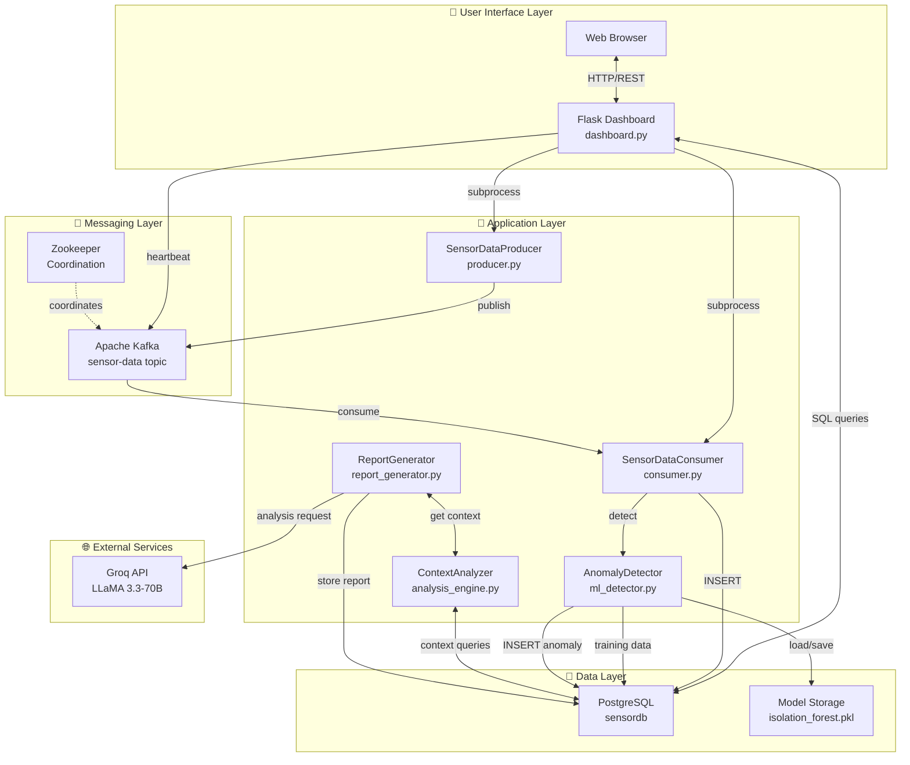

---

## 3. Component Diagram

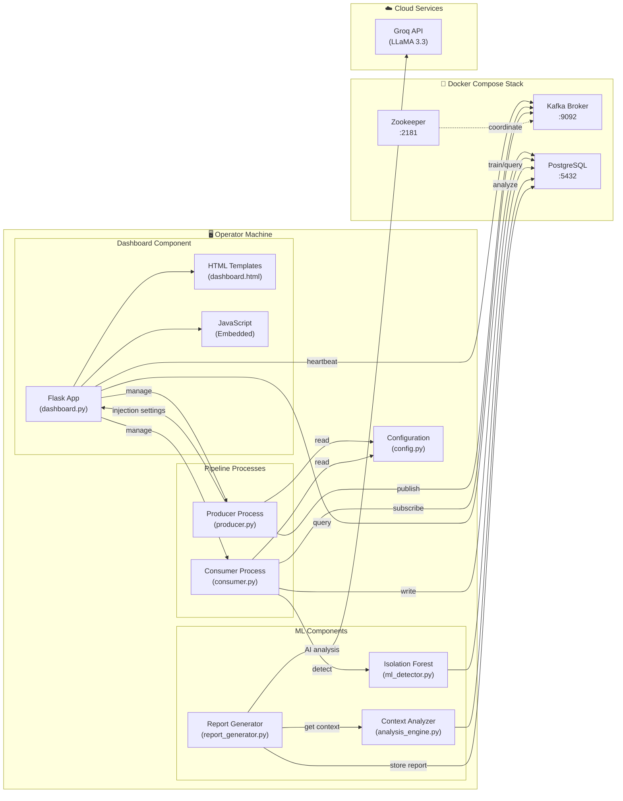

---

## 4. Data Flow Diagram

```mermaid
flowchart LR
    subgraph Generation["Data Generation"]
        SensorSim["Sensor Simulator<br/>(Correlated Values)"]
        AnomalyInject["Anomaly Injector<br/>(Optional)"]
    end

    subgraph Streaming["Message Streaming"]
        KafkaTopic["sensor-data<br/>Kafka Topic"]
    end

    subgraph Processing["Data Processing"]
        Validation["Message Validation"]
        RuleCheck["Rule-Based<br/>Anomaly Check"]
        DBInsert["Database Insert"]
        MLCheck["ML Anomaly<br/>Detection"]
    end

    subgraph Storage["Data Storage"]
        Readings["sensor_readings<br/>Table"]
        Anomalies["anomaly_detections<br/>Table"]
        Reports["analysis_reports<br/>Table"]
        Alerts["alerts<br/>Table"]
    end

    subgraph Analysis["Analysis & Reporting"]
        Context["Context Window<br/>Extraction"]
        Correlation["Correlation<br/>Analysis"]
        AIAnalysis["AI Report<br/>Generation"]
    end

    subgraph Presentation["Presentation"]
        StatsAPI["Stats API"]
        AnomalyAPI["Anomaly API"]
        ReportAPI["Report API"]
        DashboardUI["Dashboard UI"]
    end

    SensorSim --> AnomalyInject
    AnomalyInject -->|JSON message| KafkaTopic

    KafkaTopic --> Validation
    Validation -->|valid| RuleCheck
    Validation -->|invalid| Alerts

    RuleCheck -->|normal| DBInsert
    RuleCheck -->|out of range| Alerts

    DBInsert --> Readings
    DBInsert --> MLCheck

    MLCheck -->|is_anomaly=true| Anomalies
    MLCheck -->|score| Anomalies

    Anomalies --> Context
    Context --> Correlation
    Correlation --> AIAnalysis
    AIAnalysis --> Reports

    Readings --> StatsAPI
    Anomalies --> AnomalyAPI
    Reports --> ReportAPI
    Alerts --> DashboardUI

    StatsAPI --> DashboardUI
    AnomalyAPI --> DashboardUI
    ReportAPI --> DashboardUI
```

---

## 5. Sequence Diagrams

### 5.1 Complete Pipeline Flow

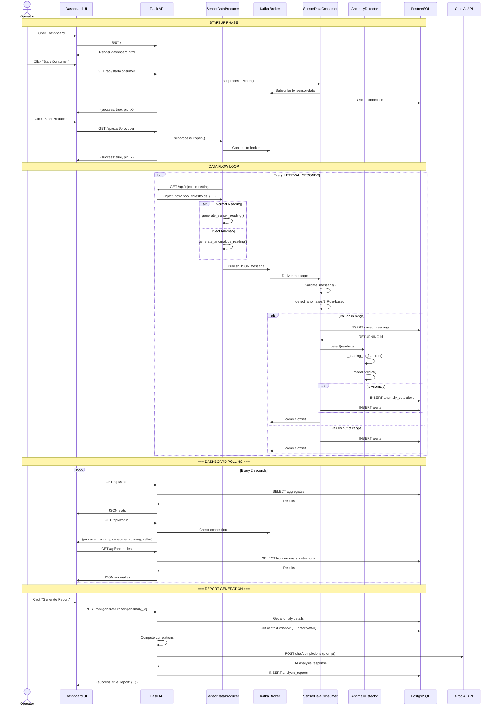

### 5.2 ML Training & Detection Flow

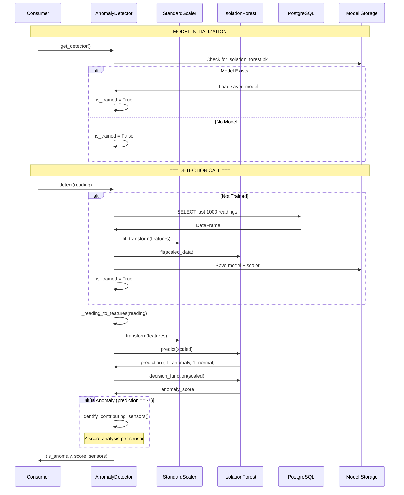

### 5.3 Full Session Report Generation

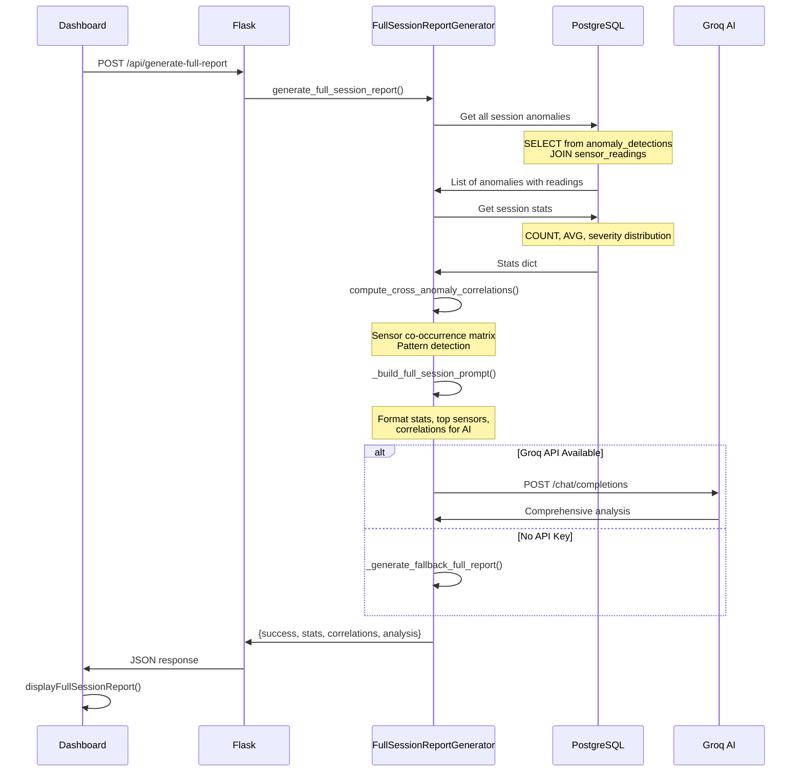

---

## 6. Class Diagrams

### 6.1 Core Classes

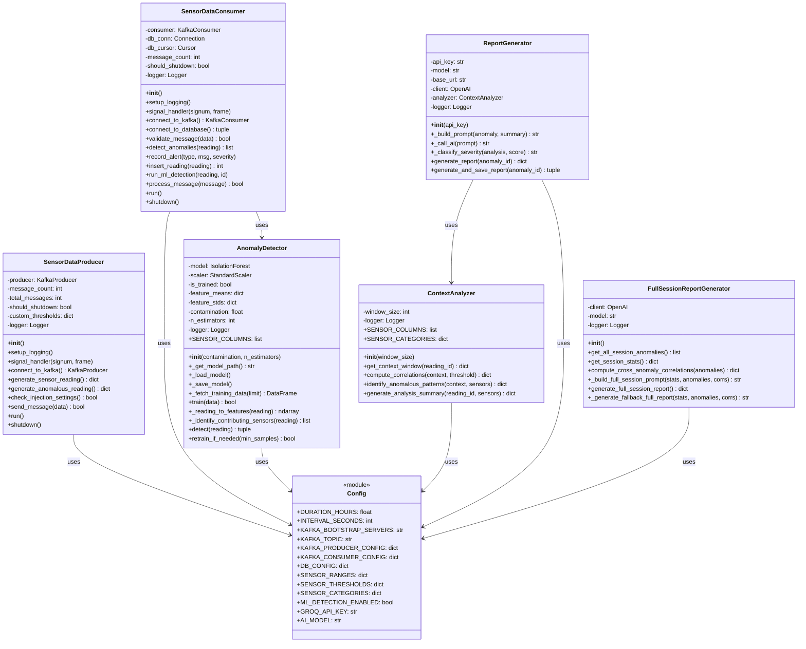

### 6.2 Dashboard Controller (Flask Routes)

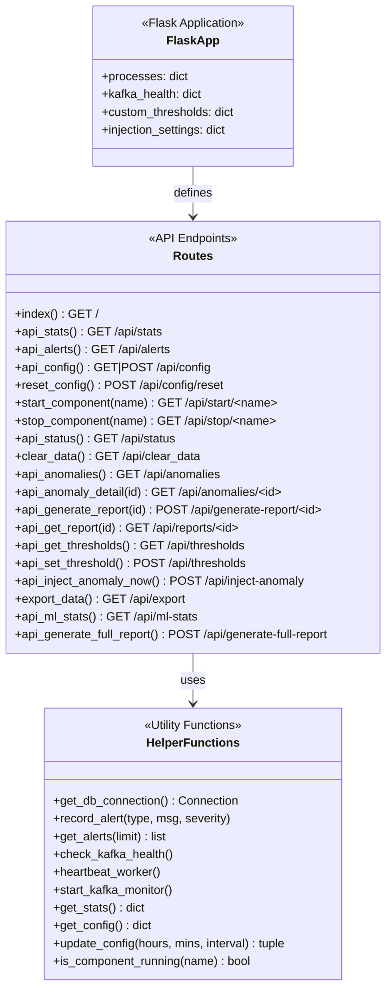

---

## 7. Database Schema (ERD)

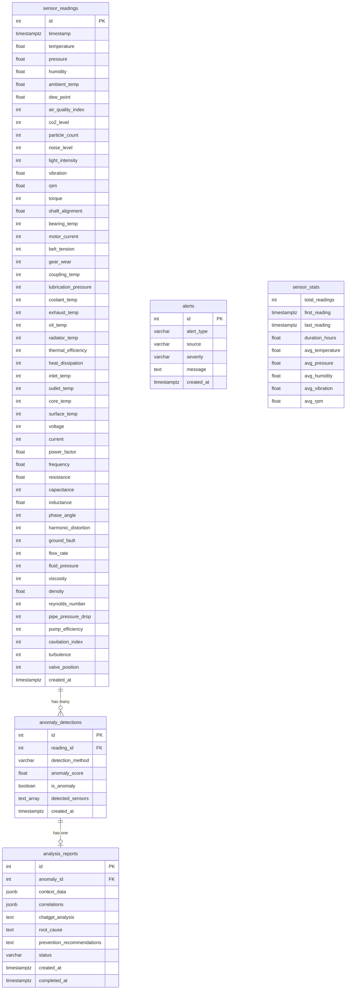

---

## 8. Deployment Diagram

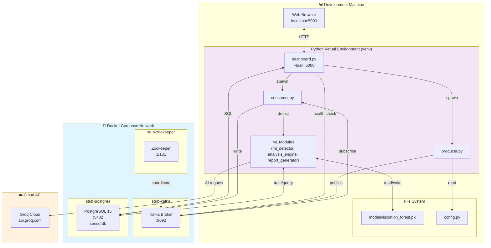

---

## 9. State Machine Diagrams

### 9.1 Producer Lifecycle

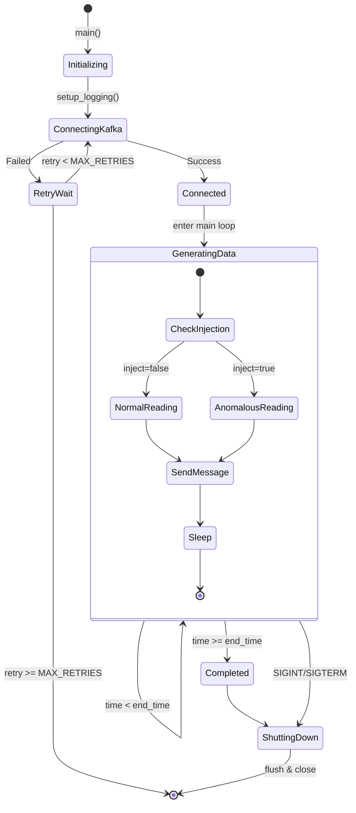

### 9.2 Consumer Lifecycle

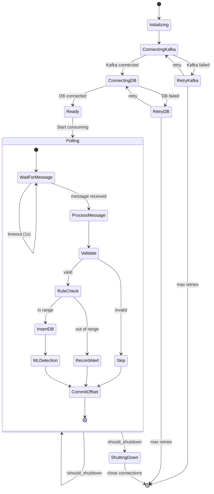

### 9.3 Anomaly Detection State

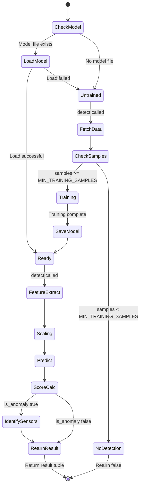

---

## 10. Activity Diagrams

### 10.1 Message Processing Flow

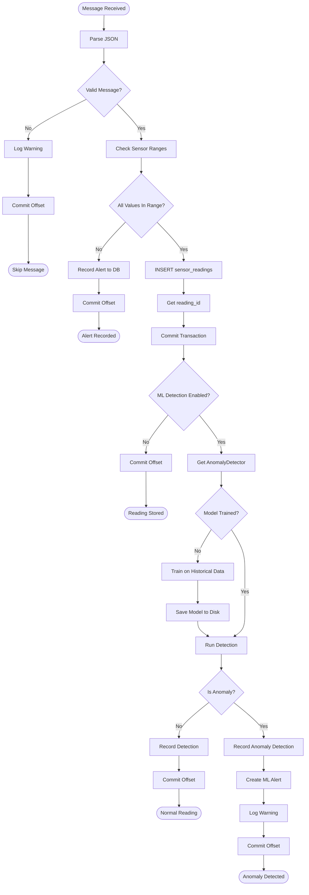

### 10.2 Report Generation Flow

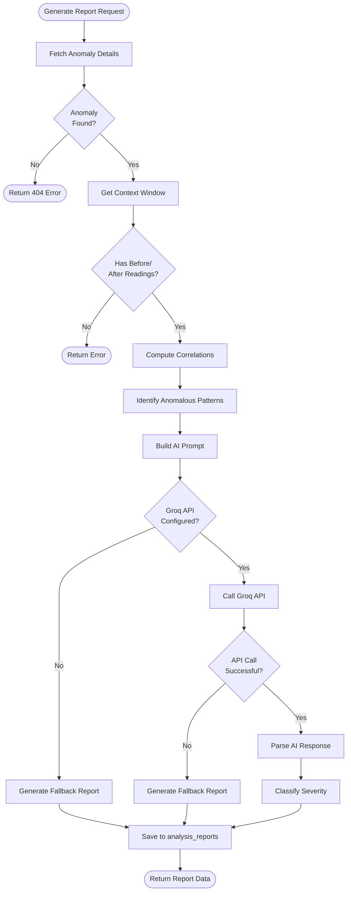

---

## 11. Package/Module Structure

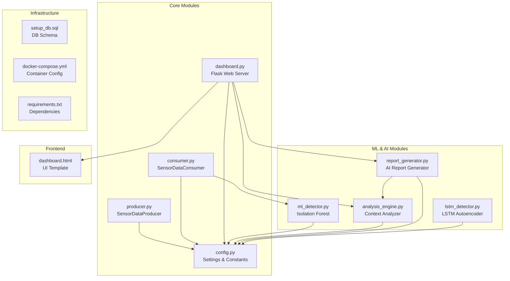

---

## Quick Reference: File → Responsibility

| File                       | Primary Responsibility                                           |
| -------------------------- | ---------------------------------------------------------------- |
| `config.py`                | All configuration constants (timing, Kafka, DB, sensors, ML, AI) |
| `producer.py`              | Generate and publish sensor data to Kafka                        |
| `consumer.py`              | Consume from Kafka, validate, store, trigger ML detection        |
| `dashboard.py`             | Flask web server, REST APIs, process management                  |
| `ml_detector.py`           | Isolation Forest training and anomaly detection                  |
| `analysis_engine.py`       | Context analysis and correlation computation                     |
| `report_generator.py`      | AI-powered report generation via Groq                            |
| `lstm_detector.py`         | (Optional) LSTM Autoencoder for sequence anomalies               |
| `setup_db.sql`             | PostgreSQL schema definition                                     |
| `docker-compose.yml`       | Container orchestration for Kafka, Zookeeper, PostgreSQL         |
| `templates/dashboard.html` | Complete frontend UI with real-time updates                      |

---

## API Endpoint Summary

| Method | Endpoint                    | Description                         |
| ------ | --------------------------- | ----------------------------------- |
| GET    | `/`                         | Dashboard HTML page                 |
| GET    | `/api/stats`                | Current sensor statistics           |
| GET    | `/api/status`               | Producer/consumer/Kafka status      |
| GET    | `/api/alerts`               | Recent alert messages               |
| GET    | `/api/anomalies`            | ML-detected anomalies list          |
| GET    | `/api/anomalies/{id}`       | Specific anomaly details            |
| GET    | `/api/ml-stats`             | ML detection statistics             |
| GET    | `/api/config`               | Current configuration               |
| POST   | `/api/config`               | Update configuration                |
| POST   | `/api/config/reset`         | Reset to defaults                   |
| GET    | `/api/start/{component}`    | Start producer or consumer          |
| GET    | `/api/stop/{component}`     | Stop producer or consumer           |
| GET    | `/api/clear_data`           | Delete all sensor readings          |
| GET    | `/api/export`               | Export readings as CSV              |
| GET    | `/api/thresholds`           | Get custom thresholds               |
| POST   | `/api/thresholds`           | Set custom threshold                |
| POST   | `/api/inject-anomaly`       | Trigger immediate anomaly injection |
| POST   | `/api/generate-report/{id}` | Generate AI report for anomaly      |
| GET    | `/api/reports/{id}`         | Get generated report                |
| POST   | `/api/generate-full-report` | Generate full session report        |

---

_This document provides a comprehensive architectural view of the Sensor Data Pipeline. Use these diagrams for system understanding, onboarding, and design discussions._
